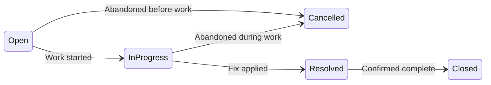

# API Contract — Support Ticket Management System

REST API contract for Core scope. Aligned with `data-model.md`, `requirements-analysis.md`, and `design-notes.md`.

**Base URL:** `http://localhost:5000/api` (adjust per local setup)

---

## Conventions

| Topic | Decision |
|-------|----------|
| Content-Type | `application/json` for all request and response bodies |
| Property casing | camelCase in JSON (`assignedTo`, `createdAt`) |
| Timestamps | ISO 8601 UTC (`2026-07-17T10:00:00Z`) |
| Authentication | None in Core — `createdBy` and `assignedTo` are sent by the client |
| Pagination | None — list endpoints return all matching records |
| String handling | Trim whitespace before validation; whitespace-only required strings are rejected |
| Concurrency | Last-write-wins (no optimistic concurrency token) |

### Endpoint summary

| Method | Path | Purpose |
|--------|------|---------|
| GET | `/api/users` | List seeded users |
| GET | `/api/tickets` | List tickets (optional `search`, `status` filters) |
| GET | `/api/tickets/{id}` | Ticket detail with comments |
| POST | `/api/tickets` | Create ticket |
| PUT | `/api/tickets/{id}` | Update non-status fields |
| PATCH | `/api/tickets/{id}/status` | Change status (state machine) |
| POST | `/api/tickets/{ticketId}/comments` | Add comment |

---

## Error response standard

All error responses use a consistent JSON envelope.

**Default shape:**

```json
{ "error": "<human-readable message>" }
```

**Coded errors** add a `code` field:

```json
{ "error": "Cannot transition from Open to Closed", "code": "INVALID_TRANSITION" }
```

### HTTP status codes

| HTTP | When | `code` | Example `error` |
|------|------|--------|-----------------|
| 200 | Successful read, update, or status change | — | *(response DTO)* |
| 201 | Ticket or comment created | — | *(response DTO)* |
| 400 | Validation failure (required, length, trim, enum, FK) | *(omitted)* | `"Title is required"` |
| 400 | `status` sent on POST or PUT | *(omitted)* | `"Status cannot be set on create. Use PATCH /api/tickets/{id}/status."` |
| 400 | Invalid status transition | `INVALID_TRANSITION` | `"Cannot transition from Open to Closed"` |
| 400 | Invalid `status` query param on list | *(omitted)* | `"Invalid status value: Urgent"` |
| 400 | Invalid enum value on PATCH status | *(omitted)* | `"Invalid status value: Urgent"` |
| 404 | Missing ticket | *(omitted)* | `"Ticket not found"` |
| 500 | Unhandled server error | *(omitted)* | `"An unexpected error occurred"` |

### Error examples

**Validation — missing title:**

```json
{ "error": "Title is required" }
```

**Validation — title too long:**

```json
{ "error": "Title must not exceed 200 characters" }
```

**Validation — non-existent user:**

```json
{ "error": "User with id 99 does not exist" }
```

**Status sent on create:**

```json
{ "error": "Status cannot be set on create. Use PATCH /api/tickets/{id}/status." }
```

**Status sent on field update:**

```json
{ "error": "Status cannot be updated via PUT. Use PATCH /api/tickets/{id}/status." }
```

**Invalid transition:**

```json
{
  "error": "Cannot transition from Open to Closed",
  "code": "INVALID_TRANSITION"
}
```

**Not found:**

```json
{ "error": "Ticket not found" }
```

**Invalid list filter:**

```json
{ "error": "Invalid status value: Urgent" }
```

---

## Enums and field constraints

### TicketPriority

| Value | Description |
|-------|-------------|
| `Low` | Low urgency |
| `Medium` | Normal urgency |
| `High` | High urgency |

### TicketStatus

| Value | Type | Description |
|-------|------|-------------|
| `Open` | Initial | Newly created ticket |
| `InProgress` | Active | Work has started |
| `Resolved` | Active | Fix applied; pending close |
| `Closed` | Terminal | Completed and closed |
| `Cancelled` | Terminal | Will not be completed |

### Field constraints

| Field | Max length | Required on | Notes |
|-------|------------|-------------|-------|
| `title` | 200 | POST, PUT | Trim; whitespace-only → 400 |
| `description` | 2000 | — | Optional; may be `null` on PUT to clear |
| `message` | 1000 | POST comment | Trim; whitespace-only → 400 |
| `priority` | — | POST, PUT | Enum: `Low`, `Medium`, `High` |
| `status` | — | PATCH only | Enum: `TicketStatus`; not accepted on POST or PUT |
| `createdBy` | — | POST ticket, POST comment | Must reference an existing user |
| `assignedTo` | — | — | Optional; `null` = unassigned; must exist if non-null |

---

## Response DTOs

### UserResponse

Used by `GET /api/users`.

```json
{
  "id": 1,
  "name": "Alice Admin",
  "email": "alice@example.com",
  "role": "Admin"
}
```

### TicketListItemResponse

Used by `GET /api/tickets`.

```json
{
  "id": 1,
  "title": "Login issue",
  "description": "Cannot log in",
  "priority": "High",
  "status": "Open",
  "assignedTo": 2,
  "assignedToName": "Bob Agent",
  "createdBy": 1,
  "createdByName": "Alice Admin",
  "createdAt": "2026-07-17T10:00:00Z",
  "updatedAt": "2026-07-17T10:00:00Z"
}
```

`assignedTo` and `assignedToName` are `null` when the ticket is unassigned.

### CommentResponse

Nested in `TicketDetailResponse`; returned directly by `POST /api/tickets/{ticketId}/comments`.

```json
{
  "id": 10,
  "message": "Investigating the issue",
  "createdBy": 2,
  "createdByName": "Bob Agent",
  "createdAt": "2026-07-17T11:00:00Z"
}
```

### TicketDetailResponse

Used by `GET`, `POST`, `PUT`, and `PATCH /api/tickets/{id}/status`.

All fields from `TicketListItemResponse`, plus:

| Field | Type | Description |
|-------|------|-------------|
| `validNextStatuses` | `string[]` | Allowed target statuses for PATCH; empty for terminal states |
| `comments` | `CommentResponse[]` | Chronological thread, oldest first |

---

## Users

### GET /users

List seeded users for `createdBy` and `assignedTo` dropdowns. Read-only — no user CRUD in Core.

**Request:** No body. No query parameters.

**Response 200:**

```json
[
  {
    "id": 1,
    "name": "Alice Admin",
    "email": "alice@example.com",
    "role": "Admin"
  },
  {
    "id": 2,
    "name": "Bob Agent",
    "email": "bob@example.com",
    "role": "Agent"
  },
  {
    "id": 3,
    "name": "Carol Agent",
    "email": "carol@example.com",
    "role": "Agent"
  }
]
```

**Errors:** None expected in normal operation.

---

## Tickets

### GET /tickets

List all tickets with optional keyword search and status filter. Returns all matching tickets (no pagination).

**Query parameters:**

| Param | Type | Required | Description |
|-------|------|----------|-------------|
| `search` | string | No | Case-insensitive match on `title` and `description` |
| `status` | string | No | Exact match on status; must be a valid `TicketStatus` enum value |

Parameters may be combined. Omitted parameters apply no filter for that dimension.

**Example requests:**

```
GET /api/tickets
GET /api/tickets?search=login
GET /api/tickets?status=Open
GET /api/tickets?search=reset&status=InProgress
```

**Response 200 — all tickets:**

```json
[
  {
    "id": 1,
    "title": "Login issue",
    "description": "Cannot log in after password reset",
    "priority": "High",
    "status": "Open",
    "assignedTo": 2,
    "assignedToName": "Bob Agent",
    "createdBy": 1,
    "createdByName": "Alice Admin",
    "createdAt": "2026-07-17T10:00:00Z",
    "updatedAt": "2026-07-17T10:00:00Z"
  },
  {
    "id": 2,
    "title": "Printer offline",
    "description": null,
    "priority": "Low",
    "status": "InProgress",
    "assignedTo": null,
    "assignedToName": null,
    "createdBy": 2,
    "createdByName": "Bob Agent",
    "createdAt": "2026-07-16T14:30:00Z",
    "updatedAt": "2026-07-17T09:15:00Z"
  }
]
```

**Response 200 — no matches:**

```json
[]
```

**Response 400 — invalid status filter:**

```json
{ "error": "Invalid status value: Urgent" }
```

---

### GET /tickets/{id}

Get a single ticket with embedded comments and valid next statuses for the UI dropdown.

**Path parameters:**

| Param | Type | Description |
|-------|------|-------------|
| `id` | integer | Ticket ID |

**Response 200:**

```json
{
  "id": 1,
  "title": "Login issue",
  "description": "Cannot log in after password reset",
  "priority": "High",
  "status": "Open",
  "assignedTo": 2,
  "assignedToName": "Bob Agent",
  "createdBy": 1,
  "createdByName": "Alice Admin",
  "createdAt": "2026-07-17T10:00:00Z",
  "updatedAt": "2026-07-17T10:00:00Z",
  "validNextStatuses": ["InProgress", "Cancelled"],
  "comments": [
    {
      "id": 10,
      "message": "Investigating the issue",
      "createdBy": 2,
      "createdByName": "Bob Agent",
      "createdAt": "2026-07-17T11:00:00Z"
    },
    {
      "id": 11,
      "message": "Reset link expired — sending a new one",
      "createdBy": 2,
      "createdByName": "Bob Agent",
      "createdAt": "2026-07-17T12:30:00Z"
    }
  ]
}
```

Comments are sorted **oldest first** (`createdAt` ascending).

**Response 200 — terminal state (no valid next statuses):**

```json
{
  "id": 5,
  "title": "Resolved ticket",
  "description": "Done",
  "priority": "Medium",
  "status": "Closed",
  "assignedTo": 2,
  "assignedToName": "Bob Agent",
  "createdBy": 1,
  "createdByName": "Alice Admin",
  "createdAt": "2026-07-10T08:00:00Z",
  "updatedAt": "2026-07-12T16:00:00Z",
  "validNextStatuses": [],
  "comments": []
}
```

**Response 404:**

```json
{ "error": "Ticket not found" }
```

---

### POST /tickets

Create a new ticket. Server sets `status` to `Open` and timestamps to UTC now. Client cannot set initial status.

**Request body:**

```json
{
  "title": "Login issue",
  "description": "Cannot log in after password reset",
  "priority": "High",
  "assignedTo": 2,
  "createdBy": 1
}
```

| Field | Type | Required | Validation |
|-------|------|----------|------------|
| `title` | string | Yes | Trim; non-empty; max 200 chars |
| `description` | string | No | Trim; max 2000 chars |
| `priority` | string | Yes | `Low`, `Medium`, or `High` |
| `assignedTo` | integer \| null | No | Must reference existing user if provided |
| `createdBy` | integer | Yes | Must reference existing user |
| `status` | — | **Rejected** | Must not appear in request body |

**Response 201:**

```json
{
  "id": 3,
  "title": "Login issue",
  "description": "Cannot log in after password reset",
  "priority": "High",
  "status": "Open",
  "assignedTo": 2,
  "assignedToName": "Bob Agent",
  "createdBy": 1,
  "createdByName": "Alice Admin",
  "createdAt": "2026-07-17T14:00:00Z",
  "updatedAt": "2026-07-17T14:00:00Z",
  "validNextStatuses": ["InProgress", "Cancelled"],
  "comments": []
}
```

**Response 400 — missing title:**

```json
{ "error": "Title is required" }
```

**Response 400 — whitespace-only title:**

```json
{ "error": "Title is required" }
```

**Response 400 — invalid priority:**

```json
{ "error": "Invalid priority value: Urgent" }
```

**Response 400 — non-existent createdBy:**

```json
{ "error": "User with id 99 does not exist" }
```

**Response 400 — status in body:**

```json
{ "error": "Status cannot be set on create. Use PATCH /api/tickets/{id}/status." }
```

**Response 400 — unassigned ticket (valid):**

Omit `assignedTo` or send `null` — both are accepted.

```json
{
  "title": "General inquiry",
  "priority": "Low",
  "createdBy": 1
}
```

---

### PUT /tickets/{id}

Update non-status fields. **Full replace** of updatable fields. Status changes are rejected — use `PATCH /api/tickets/{id}/status`.

Allowed on tickets in any status, including `Closed` and `Cancelled`.

**Path parameters:**

| Param | Type | Description |
|-------|------|-------------|
| `id` | integer | Ticket ID |

**Request body:**

```json
{
  "title": "Updated title",
  "description": "Updated description",
  "priority": "Medium",
  "assignedTo": 3
}
```

| Field | Type | Required | Validation |
|-------|------|----------|------------|
| `title` | string | Yes | Trim; non-empty; max 200 chars |
| `description` | string \| null | No | Trim; max 2000 chars; `null` clears description |
| `priority` | string | Yes | `Low`, `Medium`, or `High` |
| `assignedTo` | integer \| null | No | `null` or omitted clears assignee; must exist if non-null |
| `status` | — | **Rejected** | Must not appear in request body |

**PUT semantics:** All updatable fields must be sent. Omitted or explicit `null` on `assignedTo` clears the assignee.

**Response 200:**

```json
{
  "id": 1,
  "title": "Updated title",
  "description": "Updated description",
  "priority": "Medium",
  "status": "Open",
  "assignedTo": 3,
  "assignedToName": "Carol Agent",
  "createdBy": 1,
  "createdByName": "Alice Admin",
  "createdAt": "2026-07-17T10:00:00Z",
  "updatedAt": "2026-07-17T15:30:00Z",
  "validNextStatuses": ["InProgress", "Cancelled"],
  "comments": [
    {
      "id": 10,
      "message": "Investigating the issue",
      "createdBy": 2,
      "createdByName": "Bob Agent",
      "createdAt": "2026-07-17T11:00:00Z"
    }
  ]
}
```

**Response 400 — status in body:**

```json
{ "error": "Status cannot be updated via PUT. Use PATCH /api/tickets/{id}/status." }
```

**Response 404:**

```json
{ "error": "Ticket not found" }
```

---

### PATCH /tickets/{id}/status

Change ticket status. **Sole endpoint** for status mutations. State machine is enforced server-side.

**Path parameters:**

| Param | Type | Description |
|-------|------|-------------|
| `id` | integer | Ticket ID |

**Request body:**

```json
{ "status": "InProgress" }
```

| Field | Type | Required | Validation |
|-------|------|----------|------------|
| `status` | string | Yes | Valid `TicketStatus` enum; transition must be allowed |

**Response 200:**

Returns full `TicketDetailResponse` with updated `status`, `updatedAt`, and refreshed `validNextStatuses`.

**Response 400 — invalid enum:**

```json
{ "error": "Invalid status value: Urgent" }
```

**Response 400 — invalid transition:**

```json
{
  "error": "Cannot transition from Open to Closed",
  "code": "INVALID_TRANSITION"
}
```

**Response 404:**

```json
{ "error": "Ticket not found" }
```

See [Status state machine](#status-state-machine) for the complete transition matrix.

---

## Comments

### POST /tickets/{ticketId}/comments

Add a comment to an existing ticket. Append-only — no edit or delete in Core. Allowed on tickets in any status, including `Closed` and `Cancelled`.

**Path parameters:**

| Param | Type | Description |
|-------|------|-------------|
| `ticketId` | integer | Ticket ID |

**Request body:**

```json
{
  "message": "Investigating the issue",
  "createdBy": 2
}
```

| Field | Type | Required | Validation |
|-------|------|----------|------------|
| `message` | string | Yes | Trim; non-empty; max 1000 chars |
| `createdBy` | integer | Yes | Must reference existing user |

**Response 201:**

```json
{
  "id": 12,
  "message": "Investigating the issue",
  "createdBy": 2,
  "createdByName": "Bob Agent",
  "createdAt": "2026-07-17T16:00:00Z"
}
```

**Response 400 — empty message:**

```json
{ "error": "Message is required" }
```

**Response 400 — message too long:**

```json
{ "error": "Message must not exceed 1000 characters" }
```

**Response 400 — non-existent user:**

```json
{ "error": "User with id 99 does not exist" }
```

**Response 404:**

```json
{ "error": "Ticket not found" }
```

---

## Status state machine

Enforced exclusively via `PATCH /api/tickets/{id}/status`. The backend is the source of truth; the UI uses `validNextStatuses` from the detail response to populate the status dropdown.

### Transition diagram

```
Open        → InProgress | Cancelled
InProgress  → Resolved   | Cancelled
Resolved    → Closed
```



Terminal states (`Closed`, `Cancelled`) have no outgoing transitions.

### Valid transitions (5)

All succeed with **200** and return updated `TicketDetailResponse`.

#### 1. Open → InProgress

**Request:**

```
PATCH /api/tickets/1/status
```

```json
{ "status": "InProgress" }
```

**Response 200 (snippet):**

```json
{
  "id": 1,
  "status": "InProgress",
  "updatedAt": "2026-07-17T16:00:00Z",
  "validNextStatuses": ["Resolved", "Cancelled"]
}
```

#### 2. Open → Cancelled

**Request:**

```json
{ "status": "Cancelled" }
```

**Response 200 (snippet):**

```json
{
  "id": 1,
  "status": "Cancelled",
  "validNextStatuses": []
}
```

#### 3. InProgress → Resolved

**Request:**

```json
{ "status": "Resolved" }
```

**Response 200 (snippet):**

```json
{
  "id": 1,
  "status": "Resolved",
  "validNextStatuses": ["Closed"]
}
```

#### 4. InProgress → Cancelled

**Request:**

```json
{ "status": "Cancelled" }
```

**Response 200 (snippet):**

```json
{
  "id": 1,
  "status": "Cancelled",
  "validNextStatuses": []
}
```

#### 5. Resolved → Closed

**Request:**

```json
{ "status": "Closed" }
```

**Response 200 (snippet):**

```json
{
  "id": 1,
  "status": "Closed",
  "validNextStatuses": []
}
```

### Invalid transitions (20)

All invalid transitions return **400** with:

```json
{
  "error": "Cannot transition from {current} to {target}",
  "code": "INVALID_TRANSITION"
}
```

#### From Open (3 invalid targets)

| To | Reason |
|----|--------|
| `Open` | Same-state no-op |
| `Resolved` | Must go through InProgress |
| `Closed` | Must go through InProgress → Resolved |

**Example — Open → Closed:**

```json
{
  "error": "Cannot transition from Open to Closed",
  "code": "INVALID_TRANSITION"
}
```

**Example — Open → Open:**

```json
{
  "error": "Cannot transition from Open to Open",
  "code": "INVALID_TRANSITION"
}
```

#### From InProgress (3 invalid targets)

| To | Reason |
|----|--------|
| `Open` | No backward transition |
| `InProgress` | Same-state no-op |
| `Closed` | Must go through Resolved |

**Example — InProgress → Open:**

```json
{
  "error": "Cannot transition from InProgress to Open",
  "code": "INVALID_TRANSITION"
}
```

#### From Resolved (4 invalid targets)

| To | Reason |
|----|--------|
| `Open` | No reopen |
| `InProgress` | No reopen |
| `Resolved` | Same-state no-op |
| `Cancelled` | Cannot cancel after resolved |

**Example — Resolved → Cancelled:**

```json
{
  "error": "Cannot transition from Resolved to Cancelled",
  "code": "INVALID_TRANSITION"
}
```

#### From Closed (5 invalid targets — terminal)

| To | Reason |
|----|--------|
| `Open` | Terminal state |
| `InProgress` | Terminal state |
| `Resolved` | Terminal state |
| `Closed` | Same-state no-op |
| `Cancelled` | Terminal state |

**Example — Closed → Open:**

```json
{
  "error": "Cannot transition from Closed to Open",
  "code": "INVALID_TRANSITION"
}
```

#### From Cancelled (5 invalid targets — terminal)

| To | Reason |
|----|--------|
| `Open` | Terminal state |
| `InProgress` | Terminal state |
| `Resolved` | Terminal state |
| `Closed` | Terminal state |
| `Cancelled` | Same-state no-op |

**Example — Cancelled → InProgress:**

```json
{
  "error": "Cannot transition from Cancelled to InProgress",
  "code": "INVALID_TRANSITION"
}
```

### Transition summary

| Category | Count |
|----------|-------|
| Valid transitions | 5 |
| Invalid transitions (including same-state no-ops) | 20 |

### validNextStatuses by current status

| Current status | validNextStatuses |
|----------------|-------------------|
| `Open` | `["InProgress", "Cancelled"]` |
| `InProgress` | `["Resolved", "Cancelled"]` |
| `Resolved` | `["Closed"]` |
| `Closed` | `[]` |
| `Cancelled` | `[]` |

---

## Validation rules summary

| Rule | Endpoints | HTTP | Example error |
|------|-----------|------|---------------|
| Title required, trim, max 200 | POST, PUT | 400 | `"Title is required"` |
| Description max 2000 | POST, PUT | 400 | `"Description must not exceed 2000 characters"` |
| Priority enum required | POST, PUT | 400 | `"Invalid priority value: Urgent"` |
| `createdBy` must exist | POST ticket, POST comment | 400 | `"User with id 99 does not exist"` |
| `assignedTo` must exist if non-null | POST, PUT | 400 | `"User with id 99 does not exist"` |
| `assignedTo` null/omitted = unassigned | POST, PUT | — | Accepted |
| `status` rejected on POST | POST | 400 | `"Status cannot be set on create..."` |
| `status` rejected on PUT | PUT | 400 | `"Status cannot be updated via PUT..."` |
| `status` enum on PATCH | PATCH status | 400 | `"Invalid status value: Urgent"` |
| Invalid status transition | PATCH status | 400 | `"Cannot transition from..."` + `INVALID_TRANSITION` |
| `status` enum on list query | GET list | 400 | `"Invalid status value: Urgent"` |
| Message required, trim, max 1000 | POST comment | 400 | `"Message is required"` |
| Ticket must exist | GET, PUT, PATCH, POST comment | 404 | `"Ticket not found"` |
| Search with no matches | GET list | 200 | `[]` (not an error) |
| Field update on Closed/Cancelled | PUT | 200 | Allowed |
| Comment on Closed/Cancelled | POST comment | 201 | Allowed |

---

## Edge-case cross-reference

Maps to edge cases in `requirements-analysis.md`.

| # | Scenario | Endpoint | Expected |
|---|----------|----------|----------|
| 1 | Invalid status transition (e.g. Open → Closed) | PATCH status | 400 `INVALID_TRANSITION` |
| 2 | Same-state transition (e.g. Open → Open) | PATCH status | 400 `INVALID_TRANSITION` |
| 3 | Transition from terminal state | PATCH status | 400 `INVALID_TRANSITION` |
| 4 | Status change via PUT | PUT | 400 — status rejected |
| 5 | Whitespace-only title | POST, PUT | 400 |
| 6 | Title/description exceeds max length | POST, PUT | 400 |
| 7 | Invalid priority value | POST, PUT | 400 |
| 8 | Non-existent `createdBy` or `assignedTo` | POST, PUT | 400 |
| 9 | `assignedTo` omitted or null | POST, PUT | Accepted — unassigned |
| 10 | Non-existent ticket ID | GET, PUT, PATCH | 404 |
| 11 | Comment on non-existent ticket | POST comment | 404 |
| 12 | Whitespace-only comment message | POST comment | 400 |
| 13 | Comment message exceeds 1000 chars | POST comment | 400 |
| 14 | Non-existent `createdBy` on comment | POST comment | 400 |
| 15 | Keyword search with no matches | GET list | 200 `[]` |
| 16 | Search + status filter, no matches | GET list | 200 `[]` |
| 17 | Invalid status query param | GET list | 400 |
| 18 | Concurrent status updates | PATCH status | Last-write-wins |
| 19 | Edit fields on Closed/Cancelled ticket | PUT | 200 — allowed |
| 20 | Add comment on Closed/Cancelled ticket | POST comment | 201 — allowed |

---

## Out of scope (Core)

The following are explicitly **not** part of this API contract:

- Authentication / JWT / login
- User management (create, update, delete users)
- Ticket delete
- Pagination and sorting on list endpoints
- Comment edit or delete
- Swagger / OpenAPI generation (Stretch)
- Docker, CI/CD configuration

---

## Related documents

| Document | Content |
|----------|---------|
| `data-model.md` | Tables, indexes, enums, state machine reference |
| `requirements-analysis.md` | Functional requirements, edge cases, decisions |
| `design-notes.md` | Architecture, DTO strategy, validation flow |
| `test-strategy.md` | Integration test matrix for state machine |
