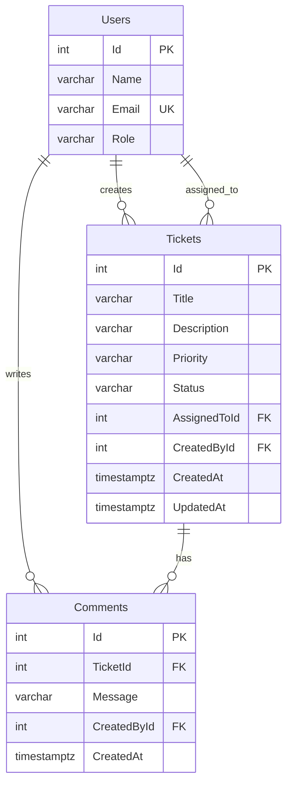

# Data Model

Core-scope persistence model for the Support Ticket Management System. Database: **PostgreSQL** via **Entity Framework Core**.

---

## Entity Relationship



**ASCII summary:**

```
Users ──────< Tickets (CreatedById, AssignedToId)
Users ──────< Comments (CreatedById)
Tickets ────< Comments (TicketId)
```

---

## Users

Read-only in Core — seeded at startup/migration; no user CRUD API.

| Column | PostgreSQL type | Constraints | Notes |
|--------|-----------------|-------------|-------|
| `Id` | `integer` | PK, `GENERATED BY DEFAULT AS IDENTITY` | |
| `Name` | `varchar(100)` | NOT NULL | Trim in application layer |
| `Email` | `varchar(200)` | NOT NULL, **UNIQUE** | |
| `Role` | `varchar(50)` | NOT NULL | Seed values (e.g. `Admin`, `Agent`); not a lookup table in Core |

### Indexes

| Index name | Columns | Type | Purpose |
|------------|---------|------|---------|
| `PK_Users` | `Id` | Primary key | |
| `UX_Users_Email` | `Email` | Unique | Prevent duplicate emails |

### Seed data

- **Count:** 3–5 users
- **Fields:** `id`, `name`, `email`, `role`
- **Mechanism:** EF Core `HasData` in migration or dedicated seed class run at startup
- **Example roles:** `Admin`, `Agent`

---

## Tickets

| Column | PostgreSQL type | Constraints | Notes |
|--------|-----------------|-------------|-------|
| `Id` | `integer` | PK, `GENERATED BY DEFAULT AS IDENTITY` | |
| `Title` | `varchar(200)` | NOT NULL | Trim; whitespace-only rejected in app |
| `Description` | `varchar(2000)` | NULL | Optional |
| `Priority` | `varchar(20)` | NOT NULL | Enum: `Low`, `Medium`, `High` |
| `Status` | `varchar(20)` | NOT NULL, default `'Open'` | Set by server on create; never from client POST |
| `AssignedToId` | `integer` | NULL, FK → `Users(Id)` | Optional assignee |
| `CreatedById` | `integer` | NOT NULL, FK → `Users(Id)` | Required on create |
| `CreatedAt` | `timestamptz` | NOT NULL | UTC; set on insert |
| `UpdatedAt` | `timestamptz` | NOT NULL | UTC; updated on field change and status change |

### Foreign keys

| Constraint | Column | References | ON DELETE |
|------------|--------|------------|-----------|
| `FK_Tickets_AssignedTo_Users` | `AssignedToId` | `Users(Id)` | RESTRICT |
| `FK_Tickets_CreatedBy_Users` | `CreatedById` | `Users(Id)` | RESTRICT |

RESTRICT prevents deleting seeded users referenced by tickets. Ticket delete is not exposed in Core.

### Indexes

| Index name | Columns | Purpose |
|------------|---------|---------|
| `PK_Tickets` | `Id` | Primary key |
| `IX_Tickets_Status` | `Status` | Status filter on `GET /api/tickets` |
| `IX_Tickets_Title` | `Title` | Keyword search (`ILIKE` on title) |
| `IX_Tickets_CreatedById` | `CreatedById` | Join for creator name |
| `IX_Tickets_AssignedToId` | `AssignedToId` | Join for assignee name |

> **Note:** Full-text or trigram indexes on title/description are optional Stretch optimizations. Core uses `ILIKE` with the indexes above; dataset is small and unpaginated.

### Business rules (application layer)

- Default `Status` = `Open` on create; client cannot set initial status
- Status changes only via `PATCH /api/tickets/{id}/status`
- Field updates (`title`, `description`, `priority`, `assignedTo`) allowed even when status is `Closed` or `Cancelled`
- `UpdatedAt` refreshed on every successful field update and status change

---

## Comments

Append-only in Core — no edit or delete.

| Column | PostgreSQL type | Constraints | Notes |
|--------|-----------------|-------------|-------|
| `Id` | `integer` | PK, `GENERATED BY DEFAULT AS IDENTITY` | |
| `TicketId` | `integer` | NOT NULL, FK → `Tickets(Id)` | |
| `Message` | `varchar(1000)` | NOT NULL | Trim; whitespace-only rejected in app |
| `CreatedById` | `integer` | NOT NULL, FK → `Users(Id)` | |
| `CreatedAt` | `timestamptz` | NOT NULL | UTC; detail view sorts **oldest first** |

### Foreign keys

| Constraint | Column | References | ON DELETE |
|------------|--------|------------|-----------|
| `FK_Comments_Ticket_Tickets` | `TicketId` | `Tickets(Id)` | CASCADE |
| `FK_Comments_CreatedBy_Users` | `CreatedById` | `Users(Id)` | RESTRICT |

CASCADE on ticket FK is defensive (ticket delete not in Core API). Comments may be added to `Closed`/`Cancelled` tickets.

### Indexes

| Index name | Columns | Purpose |
|------------|---------|---------|
| `PK_Comments` | `Id` | Primary key |
| `IX_Comments_TicketId_CreatedAt` | `(TicketId, CreatedAt)` | Chronological comment thread on ticket detail |

---

## Enums

### TicketPriority

| Value | Description |
|-------|-------------|
| `Low` | Low urgency |
| `Medium` | Normal urgency |
| `High` | High urgency |

### TicketStatus

| Value | Type | Description |
|-------|------|-------------|
| `Open` | Initial | Newly created ticket |
| `InProgress` | Active | Work has started |
| `Resolved` | Active | Fix applied; pending close |
| `Closed` | Terminal | Completed and closed |
| `Cancelled` | Terminal | Will not be completed |

### C# definitions and EF mapping

```csharp
public enum TicketPriority { Low, Medium, High }

public enum TicketStatus
{
    Open,
    InProgress,
    Resolved,
    Closed,
    Cancelled
}
```

Store `Priority` and `Status` as **strings** in PostgreSQL to match API JSON:

```csharp
entity.Property(t => t.Priority).HasConversion<string>();
entity.Property(t => t.Status).HasConversion<string>();
```

Invalid enum values are rejected in the application layer before persistence.

---

## State Machine

Enforced in the **application layer only** (not DB triggers) via `StatusTransitionService`. See `design-notes.md` for service placement and rationale.

### Valid transitions (5)

```
Open        → InProgress | Cancelled
InProgress  → Resolved   | Cancelled
Resolved    → Closed
```

| From | To | Meaning |
|------|----|---------|
| Open | InProgress | Work started |
| Open | Cancelled | Abandoned before work began |
| InProgress | Resolved | Fix applied |
| InProgress | Cancelled | Abandoned during work |
| Resolved | Closed | Confirmed complete |

### Invalid transitions

Any transition not listed above is rejected with `400` and `code: "INVALID_TRANSITION"`, including:

- Same-state no-ops (e.g. Open → Open)
- Skipping states (e.g. Open → Resolved, Open → Closed)
- Backward moves (e.g. InProgress → Open)
- Any move from terminal states (`Closed`, `Cancelled`)
- Resolved → Cancelled

**Summary:** 5 valid transitions, 20 invalid transitions (including 5 same-state no-ops).

---

## EF Core entity shape (reference)

Navigation properties for includes and mapping:

| Entity | Properties | Navigation properties |
|--------|------------|----------------------|
| `User` | `Id`, `Name`, `Email`, `Role` | `TicketsCreated`, `TicketsAssigned`, `Comments` |
| `Ticket` | `Id`, `Title`, `Description`, `Priority`, `Status`, `AssignedToId`, `CreatedById`, `CreatedAt`, `UpdatedAt` | `AssignedTo`, `CreatedBy`, `Comments` |
| `Comment` | `Id`, `TicketId`, `Message`, `CreatedById`, `CreatedAt` | `Ticket`, `CreatedBy` |

Configuration classes (`UserConfiguration`, `TicketConfiguration`, `CommentConfiguration`) live in `Data/Configurations/` and define column types, indexes, FKs, and seed data.

---

## Dev seed (optional)

Beyond the required 3–5 users, optionally seed 2–3 sample tickets with comments for local development and manual API testing. Not required for acceptance.

---

## Related documents

| Document | Content |
|----------|---------|
| `requirements-analysis.md` | Functional requirements, edge cases, decisions |
| `design-notes.md` | Architecture layers, DTO strategy, validation flow |
| `api-contract.md` | REST endpoints and JSON shapes |
| `database/setup-notes.md` | Local DB setup and migrations |
