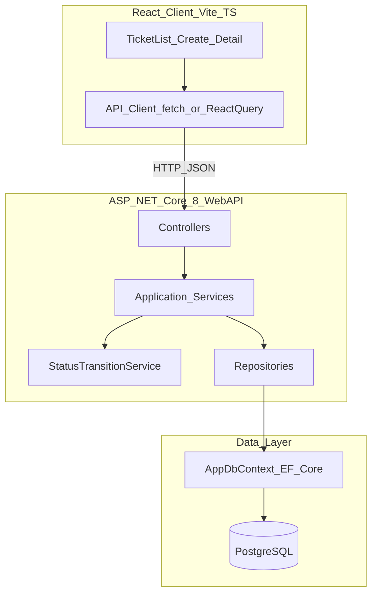
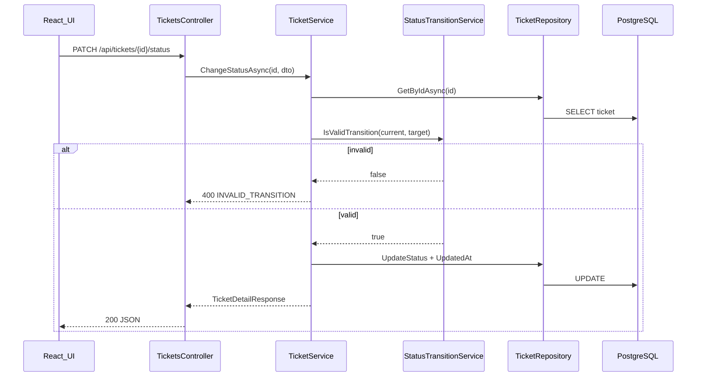

# Design Notes

Architecture and design decisions for the Support Ticket Management System (Core scope only).

**Stack:** ASP.NET Core 8 Web API · React + TypeScript (Vite) · PostgreSQL · EF Core

---

## Architecture Overview

### System diagram



### ASCII overview

```
┌─────────────┐     HTTP/JSON      ┌──────────────────┐     EF Core     ┌────────────┐
│  React UI   │ ◄──────────────► │  ASP.NET Core    │ ◄─────────────► │ PostgreSQL │
│  (Vite+TS)  │                   │  Web API         │                 │            │
└─────────────┘                   └──────────────────┘                 └────────────┘
                                         │
                    ┌────────────────────┼────────────────────┐
                    │                    │                    │
              UserService         TicketService        CommentService
                    │                    │                    │
                    │            StatusTransitionService      │
                    │                    │                    │
                    └────────────────────┴────────────────────┘
                                         │
                              Repositories → AppDbContext
```

### Status change request flow



### Cross-cutting concerns

| Concern | Approach |
|---------|----------|
| CORS | Allow Vite dev server origin (`http://localhost:5173`) |
| Errors | `ExceptionHandlingMiddleware` → consistent JSON `{ "error": "...", "code": "..." }` |
| Configuration | Connection string from environment; `.env.example` documents variables; no secrets in repo |
| Timestamps | `CreatedAt` / `UpdatedAt` set in service layer as UTC |
| Concurrency | Last-write-wins for Core (no optimistic concurrency token) |

---

## Backend Design

### Solution layout

```
src/
  SupportTicket.Api/
    Controllers/
      UsersController.cs
      TicketsController.cs              # includes POST .../comments
    DTOs/
      Requests/                         # CreateTicketRequest, UpdateTicketRequest, etc.
      Responses/                        # UserResponse, TicketDetailResponse, etc.
    Services/
      IUserService.cs / UserService.cs
      ITicketService.cs / TicketService.cs
      ICommentService.cs / CommentService.cs
      IStatusTransitionService.cs / StatusTransitionService.cs
    Repositories/
      IUserRepository.cs / UserRepository.cs
      ITicketRepository.cs / TicketRepository.cs
      ICommentRepository.cs / CommentRepository.cs
    Data/
      AppDbContext.cs
      Configurations/                   # IEntityTypeConfiguration per entity
      Migrations/
      Seed/
    Models/
      User.cs, Ticket.cs, Comment.cs
      Enums/                            # TicketPriority, TicketStatus
    Middleware/
      ExceptionHandlingMiddleware.cs
    Validators/                         # FluentValidation per request DTO
    Program.cs
```

### Layer responsibilities

| Layer | Responsibility | Core types |
|-------|----------------|------------|
| **Controllers** | HTTP routing, model binding, status codes; no business rules | `UsersController`, `TicketsController` |
| **Services** | Orchestration, DTO mapping, timestamp updates, FK checks | `TicketService`, `CommentService`, `UserService` |
| **StatusTransitionService** | Pure state-machine rules only (no DB, no HTTP) | `IsValidTransition`, `GetValidNextStatuses` |
| **Repositories** | EF queries and persistence; no HTTP/DTO concerns | Search/filter, CRUD, eager-load navigations |
| **Data** | Schema mapping, indexes, FK constraints, seed data | `AppDbContext`, `*Configuration` classes |

### Controller → service mapping (7 endpoints)

| Endpoint | Controller action | Service method |
|----------|-------------------|----------------|
| `GET /api/users` | `UsersController.GetAll` | `UserService.GetAllAsync` |
| `GET /api/tickets` | `TicketsController.GetAll` | `TicketService.ListAsync(search, status)` |
| `GET /api/tickets/{id}` | `TicketsController.GetById` | `TicketService.GetByIdAsync` |
| `POST /api/tickets` | `TicketsController.Create` | `TicketService.CreateAsync` |
| `PUT /api/tickets/{id}` | `TicketsController.Update` | `TicketService.UpdateAsync` |
| `PATCH /api/tickets/{id}/status` | `TicketsController.ChangeStatus` | `TicketService.ChangeStatusAsync` → delegates to `StatusTransitionService` |
| `POST /api/tickets/{ticketId}/comments` | `TicketsController.AddComment` | `CommentService.CreateAsync` |

**Design choice:** Comment creation is routed under `TicketsController` (`POST /api/tickets/{ticketId}/comments`) so the ticket remains the aggregate root for detail views. `CommentService` still owns all comment business logic.

### Repository query patterns

| Operation | Pattern |
|-----------|---------|
| **List** | `IQueryable` with optional `status` exact match; `search` via case-insensitive `ILIKE` on `Title` and `Description` |
| **Detail** | `Include` comments ordered by `CreatedAt ASC`; load `AssignedTo` and `CreatedBy` for denormalized names |
| **Create/update** | `SaveChangesAsync` after service sets timestamps |
| **User lookup** | `ExistsAsync(id)` for FK validation |

---

## StatusTransitionService

### Location

`Services/StatusTransitionService.cs` — the **only** component that defines valid and invalid status transitions.

### Public API (pure, stateless)

```csharp
bool IsValidTransition(TicketStatus current, TicketStatus target);
IReadOnlyList<TicketStatus> GetValidNextStatuses(TicketStatus current);
```

### Who calls it

| Caller | Usage |
|--------|-------|
| `TicketService.ChangeStatusAsync` | Validate before persist; return `400` with `INVALID_TRANSITION` on failure |
| `TicketService.GetByIdAsync` | Populate `validNextStatuses[]` on detail response for UI dropdown |
| Integration tests | Assert all 5 valid and 20 invalid transitions |
| React UI (optional mirror) | May duplicate read-only list for instant UX; **backend remains source of truth** |

### Why a single service

1. **Single source of truth** — All 5 valid and 20 invalid transitions live in one class. Rules cannot drift between controller, entity, and UI.
2. **Testability** — Pure logic with no `DbContext` or HTTP dependencies. Unit tests and `WebApplicationFactory` integration tests target one enforcement point (AC-11).
3. **Separation of concerns** — `TicketService` handles persistence and `UpdatedAt`; `StatusTransitionService` handles domain transition rules only.
4. **PATCH-only enforcement** — `TicketService.ChangeStatusAsync` is the only write path that mutates `Status`. POST/PUT DTOs omit `status`; `UpdateAsync` rejects it if sent.
5. **UI contract** — `GetValidNextStatuses` exposes allowed dropdown values without scattering transition tables across multiple API handlers.

### What it must NOT do

- Load or save tickets from the database
- Return HTTP responses
- Validate unrelated fields (title length, user FKs, etc.)

---

## DTO vs Entity Separation

### Principle

| Type | Purpose | Lives in |
|------|---------|----------|
| **Entity** | Persistence model — EF Core, navigation properties, DB mapping | `Models/` |
| **DTO** | API contract — JSON shape, input validation | `DTOs/Requests/`, `DTOs/Responses/` |

**Rule:** Never return entities directly from controllers.

### Entity models

- `User`, `Ticket`, `Comment` with navigation properties (`Ticket.Comments`, `Ticket.AssignedTo`, `Ticket.CreatedBy`, etc.)
- `TicketPriority` and `TicketStatus` enums stored as strings in PostgreSQL
- Column constraints and indexes configured in `Data/Configurations/`

See `data-model.md` for full schema.

### Request DTOs

| DTO | Fields | Deliberate omissions |
|-----|--------|----------------------|
| `CreateTicketRequest` | `title`, `description`, `priority`, `assignedTo`, `createdBy` | **No `status`** — server defaults to `Open` |
| `UpdateTicketRequest` | `title`, `description`, `priority`, `assignedTo` | **No `status`** — reject with `400` if present in body |
| `ChangeStatusRequest` | `status` | Used exclusively by `PATCH /api/tickets/{id}/status` |
| `CreateCommentRequest` | `message`, `createdBy` | `ticketId` comes from route |

FluentValidation validators: trim strings, max lengths, enum parsing, async user-existence checks via `IUserRepository`.

### Response DTOs

| DTO | Used by | Shape |
|-----|---------|-------|
| `UserResponse` | `GET /api/users` | `id`, `name`, `email`, `role` |
| `TicketListItemResponse` | `GET /api/tickets` | Ticket fields + `assignedToName`, `createdByName` |
| `TicketDetailResponse` | `GET /api/tickets/{id}`, create/update/status responses | Full ticket + `comments[]` + `validNextStatuses[]` |
| `CommentResponse` | Nested in detail | `id`, `message`, `createdBy`, `createdByName`, `createdAt` |

JSON property names use camelCase to match frontend conventions.

### Mapping strategy (Core)

- **Manual mapping** in services (private helpers or static mapper methods) — no AutoMapper dependency in Core
- Entity → response: service loads entity with includes, maps to DTO
- Request → entity: map only allowed fields; `TicketService.CreateAsync` sets `Status = Open`, `CreatedAt`/`UpdatedAt = UtcNow`
- PUT is **full replace** of updatable fields; omitted nullable `assignedTo` clears assignee

### Validation split

| Concern | Where enforced |
|---------|----------------|
| Required fields, max length, trim, enum format | FluentValidation on request DTOs |
| `status` on POST/PUT | Absent from DTO + explicit rejection if present → `400` |
| User FK exists | Async FluentValidation rule or service check |
| Status transition | `StatusTransitionService` via `TicketService.ChangeStatusAsync` |
| Invalid `status` query param on list | `TicketService.ListAsync` → `400` |
| FK / NOT NULL integrity | PostgreSQL constraints as safety net |

---

## Frontend Design

- **Pages:** Ticket list, Ticket detail, Create ticket
- **List:** Table with status filter dropdown + debounced keyword search
- **Detail:** Editable fields (PUT), status dropdown (PATCH), comment thread (oldest first) + add comment form
- **Status dropdown:** Populated from `validNextStatuses` on ticket detail response; hide control when list is empty (terminal states)
- **User dropdowns:** `GET /api/users` for `createdBy` and `assignedTo`; default first user or last selection from `localStorage`
- **Error handling:** Toast or inline alert for API errors; surface `INVALID_TRANSITION` message on status change failure
- **Empty states:** `200` with `[]` for no search results — friendly message, not an error
- **State:** React Query or `fetch` + `useState` for simplicity

---

## Database Design

See `data-model.md` for full schema, indexes, and FK rules.

| Table | Role in Core |
|-------|--------------|
| `Users` | Seeded; referenced by tickets and comments; read-only API |
| `Tickets` | CRUD (no delete); status via PATCH only |
| `Comments` | Append-only; linked to tickets and users |

---

## Validation Strategy

| Layer | What is validated |
|-------|-------------------|
| Request DTO + FluentValidation | Required fields, string lengths, trim, enum values, comment/ticket field rules |
| Service | Status transitions (`StatusTransitionService`), user FK existence, reject `status` on wrong endpoints |
| Database | FK constraints, NOT NULL, unique email |

---

## Error Handling Strategy

| HTTP code | When | Response shape |
|-----------|------|----------------|
| `200` | Successful read, update, status change, list (including empty `[]`) | Response DTO |
| `201` | Ticket or comment created | Response DTO |
| `400` | Validation failure, invalid transition, `status` on POST/PUT, invalid list query param | `{ "error": "<message>" }` or `{ "error": "<message>", "code": "INVALID_TRANSITION" }` |
| `404` | Missing ticket on GET/PUT/PATCH/comment POST | `{ "error": "Ticket not found" }` |
| `500` | Unhandled exception | Generic message; details logged server-side only |

Invalid status transitions **always** include `"code": "INVALID_TRANSITION"`.

---

## Testing Strategy Link

See `test-strategy.md` — mandatory integration tests for the state machine:

- All 5 valid transitions succeed
- Invalid transitions (including same-state and terminal-state moves) return `400` with `INVALID_TRANSITION`
- `WebApplicationFactory` + test database

`StatusTransitionService` unit tests can cover the full transition matrix without HTTP.

---

## Core scope boundaries

| In scope | Out of scope |
|----------|--------------|
| 7 REST endpoints | Authentication / JWT |
| Seeded users, `GET /api/users` | User management UI or write APIs |
| Status state machine (5 transitions) | Ticket delete |
| Search + status filter (unpaginated) | Pagination, sorting |
| Append-only comments | Comment edit/delete |
| PostgreSQL persistence | Docker, CI, Swagger (Stretch) |

---

## Related documents

| Document | Content |
|----------|---------|
| `requirements-analysis.md` | Requirements, edge cases, decisions |
| `data-model.md` | Tables, indexes, enums, state machine reference |
| `api-contract.md` | REST contract and JSON examples |
| `ui-flow.md` | Screen flows and component breakdown |
| `test-strategy.md` | Integration test matrix |
| `acceptance-criteria.md` | Definition of done |
