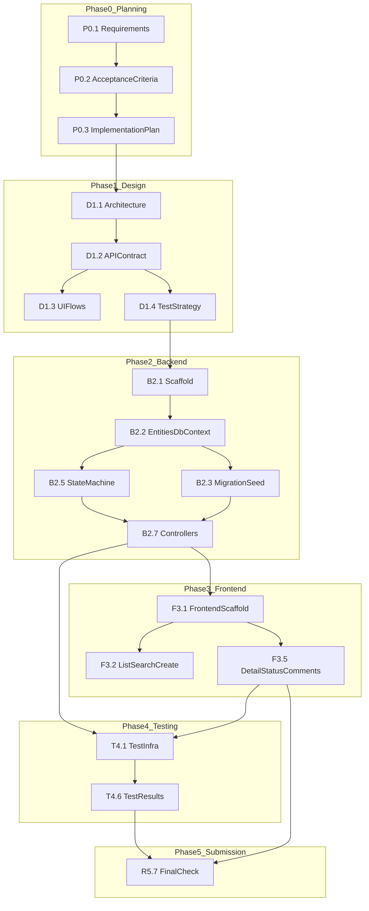

# Implementation Plan

## Overview

Build the **Core** Support Ticket Management System for the .NET AI Capability Exercise (Option 1 — Backend-Heavy).

| Layer | Technology |
|-------|------------|
| Backend | ASP.NET Core 8 Web API |
| Frontend | React 18 + TypeScript + Vite |
| Database | PostgreSQL + Entity Framework Core |
| Tests | xUnit + `WebApplicationFactory` |

**Definition of done:** All items in [acceptance-criteria.md](acceptance-criteria.md) checked off, integration tests green, lifecycle artifacts complete.

**Working style:** One new Cursor chat per AI prompt (see [PROMPT-ORDER.md](PROMPT-ORDER.md)). Always `@`-reference `tool-specific/cursor-workflow/project-context.md` and the relevant design doc. Log every AI response in the prompt file's Response Log.

---

## Core vs Stretch (scope boundary)

### In scope (this plan)

| Area | Core deliverable |
|------|------------------|
| Tickets | Create, list, detail, update fields, change status via state machine |
| Comments | Add and display (oldest first); append-only |
| Users | 3–5 seeded users; `GET /api/users` for dropdowns only |
| Search/filter | Keyword (`title` + `description`, case-insensitive) + status filter |
| State machine | 5 valid transitions; all others → `400` `INVALID_TRANSITION` |
| Validation | Server-side on all inputs; consistent error JSON |
| Persistence | PostgreSQL (SQLite acceptable for local dev); survives restart |
| Tests | State-machine integration tests + recommended validation tests |
| Docs | README, `.env.example`, `database/setup-notes.md`, lifecycle artifacts |

### Out of scope (not in this plan)

Do not implement unless you explicitly choose Stretch **after** Core is submission-ready:

- Authentication / JWT / login
- User management UI or user write APIs
- Ticket delete
- Pagination, sorting
- Docker, CI/CD, Swagger/OpenAPI
- Unit tests for every service (optional Stretch)
- UI E2E (Playwright), performance testing

---

## Task breakdown (ordered, with dependencies)

Tasks are numbered in execution order. **Depends on** lists task IDs that must be complete first.

### Phase 0 — Planning (complete before coding)

| ID | Task | Depends on | AC / artifact | AI chat |
|----|------|------------|---------------|---------|
| P0.1 | Refine requirements, state machine matrix, edge cases | — | `requirements-analysis.md` | `ai-prompts/planning.md` → Prompt 1 |
| P0.2 | Acceptance criteria checklist | P0.1 | `acceptance-criteria.md` | `ai-prompts/planning.md` → Prompt 2 |
| P0.3 | Implementation plan (this document) | P0.2 | `implementation-plan.md` | `ai-prompts/planning.md` → Prompt 3 |

### Phase 1 — Design (Day 1)

| ID | Task | Depends on | AC / artifact | AI chat |
|----|------|------------|---------------|---------|
| D1.1 | Architecture, layers, `StatusTransitionService` placement, DTO strategy | P0.3 | `design-notes.md`, `data-model.md` | `ai-prompts/design.md` → Prompt 1 |
| D1.2 | API contract — all 7 endpoints, validation rules, error shapes | D1.1 | `api-contract.md` | `ai-prompts/design.md` → Prompt 2 |
| D1.3 | UI flows — list, create, detail, status change, comments, errors | D1.2 | `ui-flow.md` | `ai-prompts/design.md` → Prompt 3 |
| D1.4 | Test strategy — integration test cases for state machine | D1.2 | `test-strategy.md` | `ai-prompts/design.md` → Prompt 4 |

**Manual checkpoint (end of Day 1):** Review design docs against `acceptance-criteria.md`. Confirm PUT vs PATCH split and all 5 valid transitions are documented before writing code.

### Phase 2 — Backend foundation (Days 2–3)

| ID | Task | Depends on | AC / artifact | AI chat |
|----|------|------------|---------------|---------|
| B2.1 | Solution scaffold — API project, folder structure, `.gitignore`, `.env.example` | D1.4 | AC-10 | Manual or small chat |
| B2.2 | EF Core entities (`User`, `Ticket`, `Comment`), `DbContext`, configurations | B2.1, D1.1 | AC-8 | `ai-prompts/implementation.md` → Prompt 1 |
| B2.3 | Initial migration + seed 3–5 users + 2–3 sample tickets | B2.2 | AC-8, seeded users | Same session as B2.2 |
| B2.4 | `database/setup-notes.md` — create DB, run migrations, seed | B2.3 | Documentation | Same session or manual |
| B2.5 | `StatusTransitionService` — `IsValidTransition`, `GetValidNextStatuses`, pure logic | B2.2, D1.2 | AC-6, centralized status logic | `ai-prompts/implementation.md` → Prompt 2 |
| B2.6 | DTOs, validators, ticket/comment/user services | B2.5 | AC-9 | `ai-prompts/implementation.md` → Prompt 3 |
| B2.7 | Controllers — all 7 endpoints; reject `status` on POST/PUT | B2.6 | AC-1–AC-7, AC-9 | Same session as B2.6 |
| B2.8 | Global error handling middleware / consistent `{ "error" }` JSON | B2.7 | Error handling section | Same session or follow-up |
| B2.9 | CORS for React dev server; verify API manually (Swagger UI optional, not required) | B2.7 | — | Manual |

**Manual checkpoint (end of Day 3):** Hit every endpoint with curl/Postman/Thunder Client. Verify create → list → detail → PUT → PATCH status (valid + invalid) → comment. Confirm data persists after API restart.

### Phase 3 — Frontend (Days 4–5)

| ID | Task | Depends on | AC / artifact | AI chat |
|----|------|------------|---------------|---------|
| F3.1 | Vite + React + TS scaffold; `VITE_API_URL`; API client helper | B2.9 | — | Manual or bundled with F3.2 |
| F3.2 | Ticket list page — table, loading/empty states | F3.1, B2.7 | AC-2 | `ai-prompts/implementation.md` → Prompt 4 |
| F3.3 | Search (debounced) + status filter; combined filters; empty results message | F3.2 | AC-7 | Same session as F3.2 |
| F3.4 | Create ticket form — fields, user dropdowns, validation errors from API | F3.1 | AC-1 | Same session as F3.2 |
| F3.5 | Ticket detail — all fields, comment thread (oldest first) | F3.1, B2.7 | AC-3 | `ai-prompts/implementation.md` → Prompt 5 |
| F3.6 | Edit fields via PUT; allow edits on Closed/Cancelled | F3.5 | AC-4 | Same session as F3.5 |
| F3.7 | Status dropdown — only valid next statuses; show `INVALID_TRANSITION` errors | F3.5, B2.5 | AC-6 | Same session as F3.5 |
| F3.8 | Add comment form; 404 page with link to list | F3.5 | AC-5, error handling | Same session as F3.5 |

**Manual checkpoint (end of Day 5):** Walk through full UI flow. Deliberately trigger invalid transition and validation errors. Confirm empty search shows friendly message, not error toast.

### Phase 4 — Testing (Day 6)

| ID | Task | Depends on | AC / artifact | AI chat |
|----|------|------------|---------------|---------|
| T4.1 | Test project + `WebApplicationFactory` + test database setup | B2.7 | AC-11 infrastructure | `ai-prompts/testing.md` → Prompt 1 |
| T4.2 | Integration tests — all 5 valid transitions | T4.1 | AC-11, Testing section | Same session as T4.1 |
| T4.3 | Integration tests — invalid transitions (representative + key edge cases) | T4.2 | AC-6, AC-11 | Same session as T4.1 |
| T4.4 | Integration tests — `status` rejected on POST/PUT; validation 400s; 404s | T4.1 | AC-9, Testing section | `ai-prompts/testing.md` → Prompt 2 |
| T4.5 | Coverage review vs `acceptance-criteria.md`; fill gaps | T4.2–T4.4 | AC-11 | `ai-prompts/testing.md` → Prompt 3 |
| T4.6 | Run `dotnet test`; record output in `test-results.md` | T4.5 | Documentation | Manual |

### Phase 5 — Review, debug, document (Day 7)

| ID | Task | Depends on | AC / artifact | AI chat |
|----|------|------------|---------------|---------|
| R5.1 | Debug any failing tests or UI/API mismatches | T4.6, F3.8 | — | `ai-prompts/debugging.md` (as needed) |
| R5.2 | Backend code review | R5.1 | — | `ai-prompts/code-review.md` → Prompt 1 |
| R5.3 | Frontend code review | R5.1 | — | `ai-prompts/code-review.md` → Prompt 2 |
| R5.4 | Apply accepted review fixes | R5.2, R5.3 | — | `ai-prompts/code-review.md` → Prompt 3 |
| R5.5 | README — setup, run, test commands | R5.4 | Documentation | `ai-prompts/documentation.md` → Prompt 1 |
| R5.6 | PR description, reflection, pre-submission checklist | R5.5 | Lifecycle artifacts | `ai-prompts/documentation.md` → Prompts 2–4 |
| R5.7 | Final pass — no secrets in repo; all AC checkboxes honest | R5.6 | AC-10 | Manual |

---

## Dependency graph

---

## 7-day self-paced timeline

Assume ~2–4 hours per day. Adjust if you have more time; do not skip backend verification or integration tests.

| Day | Milestone | Focus | Exit criteria |
|-----|-----------|-------|---------------|
| **Day 1** | M1 — Design complete | Architecture, API contract, UI flows, test strategy | All design docs filled; state machine and error shapes agreed; manual review vs `acceptance-criteria.md` |
| **Day 2** | M2a — Data layer | Scaffold, EF Core, migrations, seed data | `dotnet ef database update` succeeds; seeded users visible; sample tickets in DB |
| **Day 3** | M2b — Backend API | `StatusTransitionService` + all 7 endpoints | All endpoints manually tested; valid/invalid PATCH returns correct codes; data persists after restart |
| **Day 4** | M3a — Frontend list/create | List, search, filter, create ticket | AC-1, AC-2, AC-7 working in browser |
| **Day 5** | M3b — Frontend detail | Detail, edit, status, comments, 404 | AC-3, AC-4, AC-5, AC-6 UI behavior correct |
| **Day 6** | M4 — Tests green | Integration tests + `test-results.md` | `dotnet test` passes; state machine tests cover valid + invalid cases |
| **Day 7** | M5 — Submission ready | Review, fixes, README, reflection | All AC checked; no secrets; artifacts complete |

### Buffer strategy

- If behind on Day 4: defer polish (loading spinners, styling) until Day 7.
- If behind on Day 6: prioritize the 5 valid + 8 representative invalid transition tests before optional validation tests.
- Never defer `StatusTransitionService` or PATCH endpoint — they are the highest-risk items.

---

## AI chat session map

**Rule:** Start a **new** Cursor chat for each row below. Do not combine implementation prompts — context stays cleaner and outputs are easier to validate.

| Order | When | Chat session | Prompt file | Tasks covered |
|-------|------|--------------|-------------|---------------|
| 1 | Before code | New chat | `planning.md` P1 | P0.1 |
| 2 | Before code | New chat | `planning.md` P2 | P0.2 |
| 3 | Before code | New chat | `planning.md` P3 | P0.3 |
| 4 | Day 1 | New chat | `design.md` P1 | D1.1 |
| 5 | Day 1 | New chat | `design.md` P2 | D1.2 |
| 6 | Day 1 | New chat | `design.md` P3 | D1.3 |
| 7 | Day 1 | New chat | `design.md` P4 | D1.4 |
| 8 | Day 2 | New chat | `implementation.md` P1 | B2.2–B2.4 |
| 9 | Day 2–3 | New chat | `implementation.md` P2 | B2.5 |
| 10 | Day 3 | New chat | `implementation.md` P3 | B2.6–B2.8 |
| 11 | Day 4 | New chat | `implementation.md` P4 | F3.2–F3.4 |
| 12 | Day 5 | New chat | `implementation.md` P5 | F3.5–F3.8 |
| 13 | Day 6 | New chat | `testing.md` P1 | T4.1–T4.3 |
| 14 | Day 6 | New chat | `testing.md` P2 | T4.4 |
| 15 | Day 6 | New chat | `testing.md` P3 | T4.5 |
| 16+ | As needed | New chat | `debugging.md` | R5.1 |
| 17 | Day 7 | New chat | `code-review.md` P1 | R5.2 |
| 18 | Day 7 | New chat | `code-review.md` P2 | R5.3 |
| 19 | Day 7 | New chat | `code-review.md` P3 | R5.4 |
| 20–23 | Day 7 | New chat | `documentation.md` P1–P4 | R5.5–R5.7 |

**Can stay in the same chat (no new session required):** Manual checkpoints, running `dotnet test`, filling Response Logs, updating `test-results.md`, git commits.

**Always attach:** `tool-specific/cursor-workflow/project-context.md`, `acceptance-criteria.md`, and the doc listed in each prompt.

---

## Risks and mitigations

### Status state machine (highest priority)

| Risk | Impact | Mitigation |
|------|--------|------------|
| Transition rules scattered across controller, entity, and UI | Invalid transitions slip through; hard to test | Single `StatusTransitionService`; PATCH endpoint is the only write path for status; POST/PUT reject `status` field |
| AI suggests extra valid transitions (e.g. reopen Closed → Open) | Fails AC-6 and integration tests | Lock rules to [requirements-analysis.md](requirements-analysis.md) matrix; reject AI diffs that add transitions |
| UI allows invalid status but backend catches it | Poor UX but acceptable for Core | Prefer `GetValidNextStatuses()` for dropdown; still rely on backend as source of truth |
| Same-state PATCH (Open → Open) treated as success | Fails AC-6 | Explicitly reject no-op transitions in service; add integration test |
| Confusion between PUT (fields) and PATCH (status) | Status changed without state machine | Separate DTOs; strip/reject `status` on PUT and POST; integration tests for both |
| Terminal states (Closed/Cancelled) allow further transitions | Data integrity violation | Unit/integration tests from Closed and Cancelled to every target state |
| `GetValidNextStatuses` out of sync with `IsValidTransition` | UI shows wrong options | Implement one in terms of the other, or share a single transition map constant |

### Backend and data

| Risk | Impact | Mitigation |
|------|--------|------------|
| In-memory DB only | Fails AC-8 | Use PostgreSQL (or SQLite file) from day one; verify restart persistence in manual checkpoint |
| FK violations on `createdBy` / `assignedTo` | Runtime DB errors | Validate user IDs in service layer before save; seed users before tickets |
| Inconsistent error JSON | Frontend cannot display errors | One error middleware; match `api-contract.md` shape; test with invalid requests |
| PUT partial-update semantics unclear | Assignee not cleared when intended | Document full-replace behavior (Decision #12); test omitted `assignedTo` explicitly |

### Frontend

| Risk | Impact | Mitigation |
|------|--------|------------|
| CORS blocks API calls | UI appears broken | Configure CORS in API for Vite origin during B2.9 |
| Error messages swallowed | Fails error-handling AC | Centralize `fetch` error parsing; show `error` field from JSON body |
| Search triggers on every keystroke | Noisy API | Debounce search input (300–500 ms) |

### Process and assessment

| Risk | Impact | Mitigation |
|------|--------|------------|
| Scope creep into Stretch | Miss Core deadline | Refer to Core vs Stretch section; defer extras to post-Day-7 |
| Shallow AI prompt history | Weak Part A evidence | Log accept/reject in every Response Log immediately after each chat |
| Secrets committed | Fails AC-10 | `.env` in `.gitignore`; only `.env.example` in repo; scan before Day 7 |
| Skipping integration tests | Fails AC-11 | Reserve all of Day 6 for tests; do not start frontend polish until API verified |

---

## Acceptance criteria traceability

Quick map from milestones to official AC numbers:

| Milestone | AC covered |
|-----------|------------|
| M2b — Backend API | AC-1 (API), AC-6, AC-8, AC-9, seeded users |
| M3a — List/create | AC-1 (UI), AC-2, AC-7 |
| M3b — Detail | AC-3, AC-4, AC-5, AC-6 (UI), error handling |
| M4 — Tests | AC-11 |
| M5 — Submission | AC-10, documentation section |

---

## Pre-coding checklist

Before starting `implementation.md` Prompt 1:

- [ ] `requirements-analysis.md` — decisions table complete
- [ ] `acceptance-criteria.md` — reviewed and agreed
- [ ] `data-model.md` — entities and relationships defined
- [ ] `api-contract.md` — all 7 endpoints documented
- [ ] `ui-flow.md` — three pages and error flows sketched
- [ ] `test-strategy.md` — valid/invalid transition test cases listed
- [ ] `.env.example` planned (connection string, no real credentials)
- [ ] PostgreSQL installed or Docker container available locally

---

## Next step

Proceed to **Day 1 — Design**: `ai-prompts/design.md` → Prompt 1 (Architecture & Data Model). Use a new Cursor chat.
