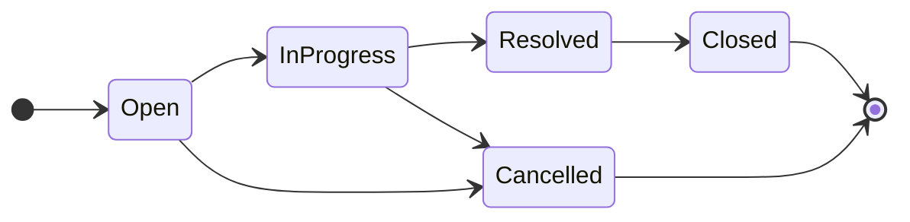

# Refined Requirement Analysis (paste into requirements-analysis.md)

Replace or merge the sections below into [requirements-analysis.md](ai-practical-assessment/requirements-analysis.md). Keeps your existing header and "My Understanding" section; updates everything from **Functional Requirements** onward.

---

## Functional Requirements

### Core scope only
_(No authentication, no user-management UI, no Stretch features such as pagination, sorting, Docker, CI, or Swagger.)_

#### Tickets
- [ ] **Create ticket** — `title` (required), `description` (optional), `priority` (required), `assignedTo` (optional), `createdBy` (required); status defaults to **Open** and is not settable on create
- [ ] **List tickets** — return all tickets from the database; support optional keyword search and status filter via query params
- [ ] **View ticket detail** — single ticket with full field set and embedded comment list
- [ ] **Update ticket fields** — `title`, `description`, `priority`, `assignedTo` via a dedicated update endpoint; **status must not be changeable through this endpoint**
- [ ] **Change status** — only via a dedicated status endpoint; backend enforces the state machine and rejects invalid transitions with a clear error
- [ ] **Data persistence** — tickets, comments, and seeded users survive application/database restarts (real DB, not in-memory only)

#### Comments
- [ ] **Add comment** — `message` (required), `createdBy` (required), linked to an existing ticket
- [ ] **Display comments** — shown on ticket detail view (sort order: document decision — see Ambiguities)

#### Users (seeded, read-only)
- [ ] **Seed users** — 3–5 users in the database with `id`, `name`, `email`, `role`
- [ ] **List users** — `GET /api/users` for assignee and `createdBy` dropdowns in the UI
- [ ] **No user CRUD** — no create/update/delete user endpoints or UI in Core

#### Validation and errors
- [ ] **Backend validation** — required fields, max lengths, enum values, and foreign-key existence enforced server-side
- [ ] **Consistent error responses** — `400` for validation/invalid transitions, `404` for missing resources
- [ ] **UI error surfacing** — validation errors, invalid transitions, and not-found states shown meaningfully to the user

#### Testing and documentation
- [ ] **State-machine integration tests** — prove all valid transitions succeed and all invalid transitions return `400`
- [ ] **README** — local setup and run instructions
- [ ] **No secrets in repo** — connection strings via environment / `.env.example` only

#### Explicitly out of Core
- Authentication / JWT / login
- User management UI or user write APIs
- Ticket delete (not specified in assessment spec)
- Pagination, sorting, Docker, CI, Swagger (Stretch)

### Entities

| Entity | Fields |
|--------|--------|
| User (seeded) | id, name, email, role |
| Ticket | id, title, description, priority, status, assignedTo, createdBy, createdAt, updatedAt |
| Comment | id, ticketId, message, createdBy, createdAt |

**Priority enum:** `Low`, `Medium`, `High`  
**Status enum:** `Open`, `InProgress`, `Resolved`, `Closed`, `Cancelled`

### API surface (Core)

| Method | Path | Purpose |
|--------|------|---------|
| GET | `/api/users` | List seeded users |
| GET | `/api/tickets` | List (+ optional `search`, `status` query params) |
| GET | `/api/tickets/{id}` | Detail + comments |
| POST | `/api/tickets` | Create ticket |
| PUT | `/api/tickets/{id}` | Update fields (not status) |
| PATCH | `/api/tickets/{id}/status` | Change status (state machine) |
| POST | `/api/tickets/{ticketId}/comments` | Add comment |

---

## Status State Machine

### States

| State | Type | Description |
|-------|------|-------------|
| Open | Initial | Newly created ticket |
| InProgress | Active | Work has started |
| Resolved | Active | Fix applied; pending close |
| Closed | Terminal | Completed and closed |
| Cancelled | Terminal | Will not be completed |

### Valid transitions (5)

| From | To | Meaning |
|------|----|---------|
| Open | InProgress | Work started |
| Open | Cancelled | Abandoned before work began |
| InProgress | Resolved | Fix applied |
| InProgress | Cancelled | Abandoned during work |
| Resolved | Closed | Confirmed complete |

### Invalid transitions — complete matrix

**Rule:** Any transition not listed in Valid transitions is rejected with `400` and `code: "INVALID_TRANSITION"`.

#### From Open (invalid: 4 of 5 targets)

| To | Valid? |
|----|--------|
| Open | **Invalid** — no-op / same-state |
| InProgress | Valid |
| Resolved | **Invalid** — must go through InProgress |
| Closed | **Invalid** — must go through InProgress → Resolved |
| Cancelled | Valid |

#### From InProgress (invalid: 3 of 5 targets)

| To | Valid? |
|----|--------|
| Open | **Invalid** — no backward transition |
| InProgress | **Invalid** — no-op / same-state |
| Resolved | Valid |
| Closed | **Invalid** — must go through Resolved |
| Cancelled | Valid |

#### From Resolved (invalid: 4 of 5 targets)

| To | Valid? |
|----|--------|
| Open | **Invalid** — no reopen |
| InProgress | **Invalid** — no reopen |
| Resolved | **Invalid** — no-op / same-state |
| Closed | Valid |
| Cancelled | **Invalid** — cannot cancel after resolved |

#### From Closed (invalid: all 5 targets — terminal)

| To | Valid? |
|----|--------|
| Open | **Invalid** — terminal state |
| InProgress | **Invalid** — terminal state |
| Resolved | **Invalid** — terminal state |
| Closed | **Invalid** — no-op / same-state |
| Cancelled | **Invalid** — terminal state |

#### From Cancelled (invalid: all 5 targets — terminal)

| To | Valid? |
|----|--------|
| Open | **Invalid** — terminal state |
| InProgress | **Invalid** — terminal state |
| Resolved | **Invalid** — terminal state |
| Closed | **Invalid** — terminal state |
| Cancelled | **Invalid** — no-op / same-state |

**Summary:** 5 valid transitions, **20 invalid transitions** (including 5 same-state no-ops).

### Enforcement rules
- Status changes **only** via `PATCH /api/tickets/{id}/status`
- Attempting to set `status` on `POST` or `PUT` is rejected (`400`) or ignored — **decide before coding** (see Ambiguities)
- UI status dropdown shows **only valid next statuses** for the current state; backend remains the source of truth

---

## Edge Cases

| # | Scenario | Expected behavior |
|---|----------|-------------------|
| 1 | Invalid status transition (e.g. Open → Closed) | `400` with `INVALID_TRANSITION`; UI shows server message |
| 2 | Same-state transition (e.g. Open → Open) | `400` with `INVALID_TRANSITION` |
| 3 | Transition from terminal state (Closed/Cancelled → any) | `400` with `INVALID_TRANSITION` |
| 4 | Status change via PUT (field update endpoint) | Reject or strip `status` field — **decide**; must not bypass state machine |
| 5 | Empty or whitespace-only title on create/update | `400` validation error |
| 6 | Title/description exceeds max length (200 / 2000) | `400` validation error |
| 7 | Invalid priority value (e.g. `"Urgent"`) | `400` validation error |
| 8 | `createdBy` or `assignedTo` references non-existent user | `400` validation error |
| 9 | `assignedTo` omitted or null on create/update | Accepted — ticket is unassigned |
| 10 | Update or fetch non-existent ticket ID | `404` `{ "error": "Ticket not found" }` |
| 11 | Add comment to non-existent ticket | `404` |
| 12 | Empty or whitespace-only comment message | `400` validation error |
| 13 | Comment message exceeds 1000 chars | `400` validation error |
| 14 | `createdBy` on comment references non-existent user | `400` validation error |
| 15 | Keyword search with no matches | `200` with empty array; UI shows "no results" — not an error |
| 16 | Search + status filter combined with no matches | `200` with empty array |
| 17 | Filter by invalid status query value | `400` or ignore invalid filter — **decide** |
| 18 | Concurrent status updates (two clients, same ticket) | **Decide:** last-write-wins vs optimistic concurrency (`409`) |
| 19 | Edit fields on Closed/Cancelled ticket | **Decide** — allow read-only vs allow field edits on terminal tickets |
| 20 | Add comment on Closed/Cancelled ticket | **Decide** — allow vs reject |

---

## Assumptions (for product owner)

Document these explicitly so scope stays clear:

1. **Single-tenant internal tool** — one organization; no multi-tenant isolation in Core
2. **No authentication in Core** — any user can perform any action; `createdBy` / `assignedTo` are selected from a dropdown (trusted client)
3. **Users are pre-seeded** — 3–5 users with roles (e.g. Admin, Agent); no user provisioning UI
4. **No ticket deletion in Core** — tickets are permanent; Cancelled is the abandon path
5. **No reopen** — Resolved and Closed are forward-only; no transition back to Open or InProgress
6. **Comments are append-only** — no edit or delete in Core
7. **Default status on create is Open** — client cannot set initial status
8. **Assignee is optional** — tickets may be unassigned (`assignedTo` null)
9. **Priority is a fixed enum** — Low, Medium, High only
10. **Search scope** — keyword matches title and description (per API contract); case-insensitivity is acceptable unless PO says otherwise
11. **Timestamps** — `createdAt` / `updatedAt` stored in UTC; `updatedAt` changes on field updates and status changes
12. **Real database** — PostgreSQL (or SQLite for local dev); data persists across restarts
13. **No pagination in Core** — list returns all matching tickets
14. **Status logic in one service** — `StatusTransitionService` is the single enforcement point
15. **Separate endpoints for fields vs status** — PUT for fields, PATCH for status

---

## Ambiguities — decide before coding

Resolve these in a short "Decisions" subsection (or update Assumptions) so implementation and tests stay consistent:

| # | Question | Recommended default | Impact |
|---|----------|---------------------|--------|
| 1 | Can tickets be reopened after Resolved/Closed? | **No** — matches state machine | Tests, UI status dropdown |
| 2 | Are comments editable/deletable? | **No** — append-only in Core | API shape, UI |
| 3 | Is assignee required on create? | **No** — optional | Validation rules |
| 4 | Can fields be updated on Closed/Cancelled tickets? | **Yes** — allow edits; only status is locked | PUT handler, UI disable logic |
| 5 | Can comments be added to Closed/Cancelled tickets? | **Yes** — post-close notes are useful | POST comment handler |
| 6 | Comment sort order on detail view? | **Oldest first** (chronological thread) | UI + API response order |
| 7 | What if client sends `status` on POST or PUT? | **Reject with 400** — forces use of PATCH | Validation on create/update DTOs |
| 8 | Invalid `status` query param on list? | **400** — strict validation | GET /tickets handler |
| 9 | Search: case-sensitive or insensitive? | **Case-insensitive** | DB query / EF filter |
| 10 | How does UI pick `createdBy` without auth? | **Dropdown of seeded users**; default first user or remember last selection in localStorage | UI only |
| 11 | Concurrent status updates? | **Last-write-wins** for Core (simplest); document in assumptions | Optional: row version later |
| 12 | PUT: full replace or partial update? | **Full replace of updatable fields** — omitted nullable fields may clear assignee | DTO design |
| 13 | Whitespace-only strings — trim before validate? | **Trim; empty after trim = invalid** for required fields | Validation helper |
| 14 | Is ticket delete needed? | **No** in Core — not in spec | Scope control |

---

## Non-Functional Requirements

_(Unchanged from your draft — keep as-is.)_

- Backend validates all required fields; reject invalid input with clear error messages
- UI shows meaningful error states (validation, invalid transition, not found)
- README with local setup instructions
- No secrets committed to the repository
- Integration tests prove state-machine rules

---

## Suggested next step

After pasting, add a **Decisions** table with your chosen answers to the 14 ambiguities (especially #4, #5, #7, #11). Prompt 2 in [ai-prompts/planning.md](ai-practical-assessment/ai-prompts/planning.md) can then turn this into acceptance criteria.
