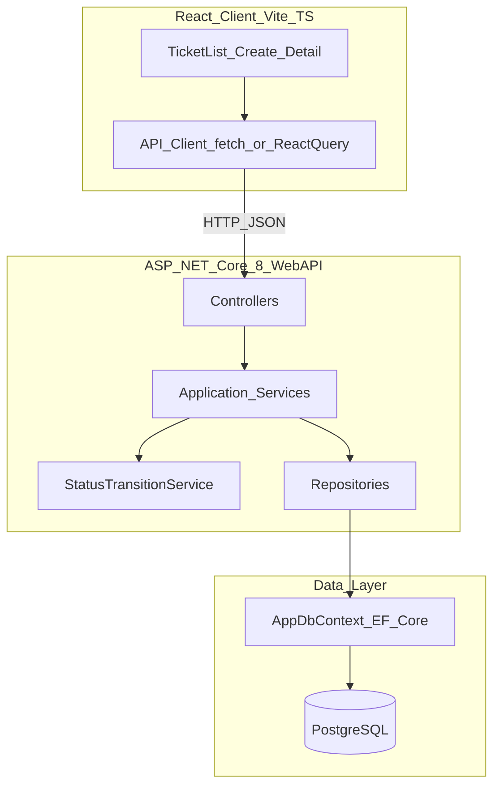
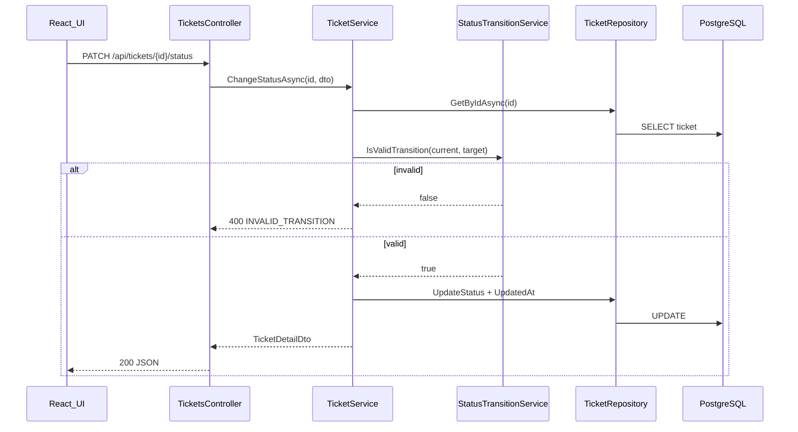
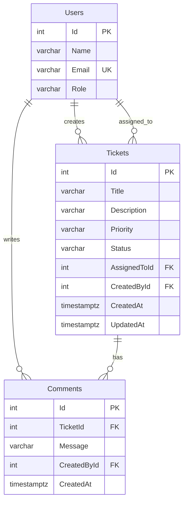

# Support Ticket Management System — Architecture Design (Core)

## Deliverable summary

After approval, update two files only (no implementation code):

| File | What gets added |
|------|-----------------|
| [data-model.md](data-model.md) | Full ER diagram, table specs, enums, FK/delete rules, indexes, EF mapping notes |
| [design-notes.md](design-notes.md) | Mermaid architecture, backend folder/layer breakdown, StatusTransitionService rationale, DTO strategy, validation/error flow |

---

## 1. High-level architecture



**Request flow (example: status change)**



**Cross-cutting concerns (document in design-notes):**

- CORS for Vite dev server (`localhost:5173`)
- Global exception middleware → consistent `{ "error": "...", "code": "..." }` JSON
- Connection string from environment / `.env.example` (no secrets in repo)
- UTC timestamps set in service layer on create/update

---

## 2. Backend layer structure

Proposed solution layout under `src/` (matches [project-context.md](tool-specific/cursor-workflow/project-context.md)):

```
src/
  SupportTicket.Api/
    Controllers/
      UsersController.cs
      TicketsController.cs          # includes nested comment route OR separate CommentsController
    DTOs/
      Requests/                     # CreateTicketRequest, UpdateTicketRequest, ChangeStatusRequest, CreateCommentRequest
      Responses/                    # UserResponse, TicketListItemResponse, TicketDetailResponse, CommentResponse
    Services/
      IUserService.cs / UserService.cs
      ITicketService.cs / TicketService.cs
      ICommentService.cs / CommentService.cs
      IStatusTransitionService.cs / StatusTransitionService.cs
    Repositories/
      IUserRepository.cs / UserRepository.cs
      ITicketRepository.cs / TicketRepository.cs
      ICommentRepository.cs / CommentRepository.cs
    Data/
      AppDbContext.cs
      Configurations/                 # IEntityTypeConfiguration per entity
      Migrations/
      Seed/                           # IUserSeeder or DbInitializer
    Models/                           # EF entities (domain persistence model)
      User.cs, Ticket.cs, Comment.cs
      Enums/                          # TicketPriority, TicketStatus
    Middleware/
      ExceptionHandlingMiddleware.cs
    Validators/                       # FluentValidation validators per request DTO
    Program.cs
```

### Layer responsibilities

| Layer | Responsibility | Core types |
|-------|----------------|------------|
| **Controllers** | HTTP routing, model binding, status codes; no business rules | `UsersController`, `TicketsController` |
| **Services** | Business orchestration, validation orchestration, DTO mapping, timestamp updates | `TicketService`, `CommentService`, `UserService` |
| **StatusTransitionService** | Pure state-machine rules only (no DB, no HTTP) | `IsValidTransition`, `GetValidNextStatuses` |
| **Repositories** | EF queries and persistence; no HTTP/DTO concerns | Filter/search, CRUD, include navigation props |
| **Data (DbContext + Config)** | Schema mapping, indexes, FK constraints, seed data | `AppDbContext`, `*Configuration` classes |

### Controller → service mapping (7 endpoints)

| Endpoint | Controller action | Service method |
|----------|-------------------|----------------|
| `GET /api/users` | `UsersController.GetAll` | `UserService.GetAllAsync` |
| `GET /api/tickets` | `TicketsController.GetAll` | `TicketService.ListAsync(search, status)` |
| `GET /api/tickets/{id}` | `TicketsController.GetById` | `TicketService.GetByIdAsync` |
| `POST /api/tickets` | `TicketsController.Create` | `TicketService.CreateAsync` |
| `PUT /api/tickets/{id}` | `TicketsController.Update` | `TicketService.UpdateAsync` |
| `PATCH /api/tickets/{id}/status` | `TicketsController.ChangeStatus` | `TicketService.ChangeStatusAsync` → **delegates to** `StatusTransitionService` |
| `POST /api/tickets/{id}/comments` | `TicketsController.AddComment` (or `CommentsController`) | `CommentService.CreateAsync` |

**Design choice:** Nest comment POST under `TicketsController` as `POST /api/tickets/{ticketId}/comments` to keep ticket as aggregate root for detail; `CommentService` still owns comment logic.

### Repository query notes (for design-notes)

- **List:** `IQueryable` filter — `status` exact match; `search` case-insensitive `ILIKE` on `Title` and `Description` (PostgreSQL)
- **Detail:** `Include` ticket → `Comments` ordered by `CreatedAt ASC`, join/load `CreatedBy` and `AssignedTo` user names
- **No ticket delete in Core** — FK delete behavior is defensive (`RESTRICT` on user FKs)

---

## 3. Complete data model (content for data-model.md)

### ER diagram (mermaid)



### Users table

| Column | PostgreSQL type | Constraints | Notes |
|--------|-----------------|-------------|-------|
| `Id` | `integer` | PK, `GENERATED BY DEFAULT AS IDENTITY` | |
| `Name` | `varchar(100)` | NOT NULL | Trim in app layer |
| `Email` | `varchar(200)` | NOT NULL, **UNIQUE** | |
| `Role` | `varchar(50)` | NOT NULL | e.g. `Admin`, `Agent` — seed values, not enum table in Core |

**Indexes:** `UX_Users_Email` (unique on `Email`)

**Seed:** 3–5 rows via EF `HasData` or migration seed script

### Tickets table

| Column | PostgreSQL type | Constraints | Notes |
|--------|-----------------|-------------|-------|
| `Id` | `integer` | PK, identity | |
| `Title` | `varchar(200)` | NOT NULL | Trim; whitespace-only rejected in app |
| `Description` | `varchar(2000)` | NULL | |
| `Priority` | `varchar(20)` | NOT NULL | Check or app enum: `Low`, `Medium`, `High` |
| `Status` | `varchar(20)` | NOT NULL, default `'Open'` | App sets on create; never from client POST body |
| `AssignedToId` | `integer` | NULL, FK → `Users(Id)` | Optional assignee |
| `CreatedById` | `integer` | NOT NULL, FK → `Users(Id)` | |
| `CreatedAt` | `timestamptz` | NOT NULL | UTC, set on insert |
| `UpdatedAt` | `timestamptz` | NOT NULL | UTC, set on insert + every field/status update |

**Foreign keys:**

- `FK_Tickets_AssignedTo_Users` → `Users(Id)` ON DELETE **RESTRICT** (or NO ACTION)
- `FK_Tickets_CreatedBy_Users` → `Users(Id)` ON DELETE **RESTRICT**

**Indexes:**

| Index | Columns | Purpose |
|-------|---------|---------|
| `IX_Tickets_Status` | `Status` | Status filter on list |
| `IX_Tickets_Title` | `Title` | Supports search (with `ILIKE` in query) |
| `IX_Tickets_CreatedById` | `CreatedById` | Join for creator name |
| `IX_Tickets_AssignedToId` | `AssignedToId` | Join for assignee name |

Optional Core stretch in docs: GIN/trigram index on title+description — **not required** for Core (small dataset, no pagination).

### Comments table

| Column | PostgreSQL type | Constraints | Notes |
|--------|-----------------|-------------|-------|
| `Id` | `integer` | PK, identity | |
| `TicketId` | `integer` | NOT NULL, FK → `Tickets(Id)` | |
| `Message` | `varchar(1000)` | NOT NULL | Trim; append-only |
| `CreatedById` | `integer` | NOT NULL, FK → `Users(Id)` | |
| `CreatedAt` | `timestamptz` | NOT NULL | UTC; detail sorts ASC |

**Foreign keys:**

- `FK_Comments_Ticket_Tickets` → `Tickets(Id)` ON DELETE **CASCADE** (orphan comments impossible; ticket delete not exposed in API)
- `FK_Comments_CreatedBy_Users` → `Users(Id)` ON DELETE **RESTRICT**

**Indexes:**

| Index | Columns | Purpose |
|-------|---------|---------|
| `IX_Comments_TicketId_CreatedAt` | `(TicketId, CreatedAt)` | Chronological thread on detail |

### C# enums (EF mapping)

Store as **strings** in PostgreSQL (matches existing [data-model.md](data-model.md) and API JSON):

```csharp
public enum TicketPriority { Low, Medium, High }
public enum TicketStatus { Open, InProgress, Resolved, Closed, Cancelled }
```

EF Core: `.HasConversion<string>()` on `Priority` and `Status` columns.

### State machine (reference block in data-model.md)

Keep the transition diagram; note enforcement is **application-layer only** (not DB triggers) via `StatusTransitionService`.

---

## 4. Status state machine — single service (content for design-notes)

**Location:** `StatusTransitionService` in `Services/` — the **only** component that knows valid/invalid transitions.

**Public API (pure, stateless):**

- `bool IsValidTransition(TicketStatus current, TicketStatus target)`
- `IReadOnlyList<TicketStatus> GetValidNextStatuses(TicketStatus current)`

**Who calls it:**

| Caller | Usage |
|--------|-------|
| `TicketService.ChangeStatusAsync` | Validate before persist; throw/return `INVALID_TRANSITION` on failure |
| `TicketService.GetByIdAsync` (optional) | Expose `validNextStatuses[]` on detail DTO for UI dropdown |
| Integration tests | Assert all 5 valid + 20 invalid transitions without HTTP |
| React UI (mirror) | May duplicate read-only list for UX; **backend remains source of truth** |

**Why a single service (document explicitly):**

1. **Single source of truth** — 5 valid / 20 invalid transitions live in one file; no drift between controller, entity, and UI.
2. **Testability** — Pure logic with no `DbContext` or HTTP; unit tests + `WebApplicationFactory` integration tests target one class ([test-strategy.md](test-strategy.md), AC-11).
3. **Separation of concerns** — `TicketService` handles persistence and timestamps; `StatusTransitionService` handles domain rules only.
4. **PATCH-only enforcement** — `TicketService` is the only write path that mutates `Status`; POST/PUT DTOs omit `status`, and `UpdateAsync` ignores/rejects it.
5. **UI contract** — `GetValidNextStatuses` gives the frontend allowed dropdown values without duplicating rule tables in multiple API handlers.

**What StatusTransitionService must NOT do:** load tickets, save to DB, return HTTP responses, or validate unrelated fields.

---

## 5. DTO vs entity separation (content for design-notes)

### Principle

**Entities** = persistence model (EF Core, navigation properties, DB concerns).  
**DTOs** = API contract (JSON shape, validation attributes/FluentValidation).  
Never return entities from controllers.

### Entity models (`Models/`)

- `User`, `Ticket`, `Comment` with navigation props (`Ticket.Comments`, `Ticket.AssignedTo`, etc.)
- May contain EF-specific annotations or `IEntityTypeConfiguration`
- Include `TicketPriority` / `TicketStatus` enums

### Request DTOs (`DTOs/Requests/`)

| DTO | Fields | Deliberate omissions |
|-----|--------|----------------------|
| `CreateTicketRequest` | `title`, `description`, `priority`, `assignedTo`, `createdBy` | **No `status`** — server defaults to `Open` |
| `UpdateTicketRequest` | `title`, `description`, `priority`, `assignedTo` | **No `status`** — reject if present in body |
| `ChangeStatusRequest` | `status` only | Used exclusively by PATCH |
| `CreateCommentRequest` | `message`, `createdBy` | `ticketId` from route |

Validators (FluentValidation): trim strings, max lengths, enum parsing, user ID existence (async rule calling `IUserRepository`).

### Response DTOs (`DTOs/Responses/`)

| DTO | Used by | Notes |
|-----|---------|-------|
| `UserResponse` | `GET /users` | `id`, `name`, `email`, `role` |
| `TicketListItemResponse` | `GET /tickets` | Flat IDs + denormalized `assignedToName`, `createdByName` |
| `TicketDetailResponse` | `GET /tickets/{id}`, create/update/status responses | Includes `comments[]` + optional `validNextStatuses[]` |
| `CommentResponse` | Nested in detail | `id`, `message`, `createdBy`, `createdByName`, `createdAt` |

### Mapping strategy (Core)

- **Manual mapping** in services (static mapper methods or small private helpers) — no AutoMapper dependency unless desired in Stretch
- Service loads entity + includes → maps to response DTO
- Request DTO → entity: map only allowed fields; `TicketService.CreateAsync` sets `Status = Open`, `CreatedAt`/`UpdatedAt = UtcNow`

### Validation split (table for design-notes)

| Concern | Where |
|---------|-------|
| Required, max length, trim, enum format | FluentValidation on request DTOs |
| `status` on POST/PUT | DTO absent + controller/model binder check → `400` |
| FK user exists | Service or async FluentValidation rule |
| Status transition | `StatusTransitionService` via `TicketService` |
| FK / NOT NULL | Database constraints as safety net |

---

## 6. Planned file updates (exact sections)

### [data-model.md](data-model.md)

Replace/expand current skeleton with:

1. Mermaid ER diagram
2. Per-table column specs (as above) with PostgreSQL types
3. FK relationships and ON DELETE behavior
4. Full index list with rationale
5. C# enum definitions and EF string conversion note
6. State machine reference diagram (keep existing ASCII)
7. Seed data requirements (3–5 users; optional sample tickets for dev)

### [design-notes.md](design-notes.md)

Replace/expand with:

1. Mermaid system architecture + sequence diagram for status change
2. Backend folder structure and layer responsibility table
3. Controller/service/repository mapping for all 7 endpoints
4. **StatusTransitionService** section with rationale (5 bullets above)
5. **DTO vs entity** section with request/response tables and mapping approach
6. Retain/refine existing Frontend Design, Validation Strategy, Error Handling, Testing Strategy Link sections — align error codes with `INVALID_TRANSITION` and PUT/PATCH split
7. Frontend note: status dropdown driven by `validNextStatuses` from API (or client mirror of same rules)

---

## Alignment checklist

- Matches all 7 endpoints in [requirements-analysis.md](requirements-analysis.md)
- `StatusTransitionService` as single enforcement point (Assumption #14, AC supporting criteria)
- PUT full-replace semantics; PATCH exclusive for status
- Field updates allowed on Closed/Cancelled; status locked in terminal states
- Comments append-only, oldest-first on detail
- No auth, no user CRUD, no ticket delete, no pagination (Core boundary)

## Out of scope for this task

- No changes to [api-contract.md](api-contract.md), [ui-flow.md](ui-flow.md), or [test-strategy.md](test-strategy.md) (separate design prompts)
- No `src/` code, migrations, or tests
