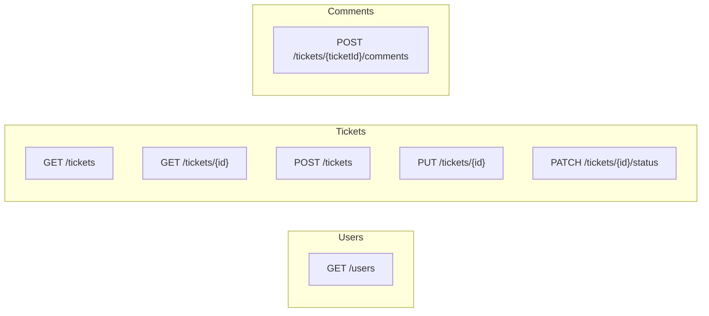

# REST API Contract for Support Ticket Management System

## Deliverable

Replace/expand [`api-contract.md`](api-contract.md) with a production-ready contract aligned to [`data-model.md`](data-model.md), [`requirements-analysis.md`](requirements-analysis.md), and [`design-notes.md`](design-notes.md). No implementation code.

---

## Conventions (document header)

| Topic | Decision |
|-------|----------|
| Base URL | `http://localhost:5000/api` |
| Content-Type | `application/json` for all request/response bodies |
| Property casing | camelCase in JSON (`assignedTo`, `createdAt`) |
| Timestamps | ISO 8601 UTC (`2026-07-17T10:00:00Z`) |
| Auth | None in Core — `createdBy` / `assignedTo` sent by client |
| Pagination | None — list returns all matching tickets |

---

## Standard error response shape

All errors use a single consistent envelope:

```json
{ "error": "<human-readable message>" }
```

Coded errors add `code`:

```json
{ "error": "Cannot transition from Open to Closed", "code": "INVALID_TRANSITION" }
```

| HTTP | When | `code` (if any) | Example `error` |
|------|------|-----------------|-----------------|
| 400 | Validation (required, length, trim, enum, FK) | *(omitted)* | `"Title is required"` |
| 400 | `status` sent on POST or PUT | *(omitted)* | `"Status cannot be set on create. Use PATCH /api/tickets/{id}/status."` |
| 400 | Invalid status transition | `INVALID_TRANSITION` | `"Cannot transition from Open to Closed"` |
| 400 | Invalid `status` query param on list | *(omitted)* | `"Invalid status value: Urgent"` |
| 404 | Missing ticket | *(omitted)* | `"Ticket not found"` |
| 500 | Unhandled server error | *(omitted)* | `"An unexpected error occurred"` |

Same-state and terminal-state transitions always use `code: "INVALID_TRANSITION"`.

---

## Shared data types

Document enum values and field constraints once, referenced by endpoints:

**TicketPriority:** `Low` | `Medium` | `High`

**TicketStatus:** `Open` | `InProgress` | `Resolved` | `Closed` | `Cancelled`

**Field limits** (from data model):

| Field | Max length | Required | Notes |
|-------|------------|----------|-------|
| `title` | 200 | Yes (create/update) | Trim; whitespace-only → 400 |
| `description` | 2000 | No | Trim allowed |
| `message` (comment) | 1000 | Yes | Trim; whitespace-only → 400 |
| `priority` | — | Yes (create) | Enum only |
| `status` | — | PATCH only | Enum only; not on POST/PUT |
| `createdBy` | — | Yes (create ticket, create comment) | Must reference existing user |
| `assignedTo` | — | No | `null` = unassigned; must exist if non-null |

---

## Endpoints (7 total)



### 1. GET /users

- **Purpose:** Read-only list of seeded users for dropdowns
- **Response 200:** Array of `UserResponse` — `{ id, name, email, role }`
- **Example:** 3–5 seeded users
- **Errors:** None expected (empty array if no seed — unlikely)

### 2. GET /tickets

- **Query params:**

| Param | Type | Required | Behavior |
|-------|------|----------|----------|
| `search` | string | No | Case-insensitive `ILIKE` on `title` and `description` |
| `status` | string | No | Exact match; must be valid enum or **400** |

- **Response 200:** Array of `TicketListItemResponse` (no comments, no `validNextStatuses`)
- **Examples to include:**
  - No filters (all tickets)
  - `?search=login`
  - `?status=Open`
  - `?search=reset&status=InProgress`
  - No matches → `200` with `[]`
  - Invalid status → `400`

**`TicketListItemResponse` shape:**

```json
{
  "id": 1,
  "title": "Login issue",
  "description": "Cannot log in",
  "priority": "High",
  "status": "Open",
  "assignedTo": 2,
  "assignedToName": "Bob Agent",
  "createdBy": 1,
  "createdByName": "Alice Admin",
  "createdAt": "2026-07-17T10:00:00Z",
  "updatedAt": "2026-07-17T10:00:00Z"
}
```

`assignedTo` / `assignedToName` are `null` when unassigned.

### 3. GET /tickets/{id}

- **Response 200:** `TicketDetailResponse` = list item fields + `comments[]` + `validNextStatuses[]`
- **Comments:** Sorted **oldest first** (`createdAt` ASC)
- **`validNextStatuses`:** Computed by `StatusTransitionService.GetValidNextStatuses` — empty array for terminal states (`Closed`, `Cancelled`)
- **Response 404:** `{ "error": "Ticket not found" }`

**Example detail response** (Open ticket):

```json
{
  "id": 1,
  "title": "Login issue",
  "description": "Cannot log in after password reset",
  "priority": "High",
  "status": "Open",
  "assignedTo": 2,
  "assignedToName": "Bob Agent",
  "createdBy": 1,
  "createdByName": "Alice Admin",
  "createdAt": "2026-07-17T10:00:00Z",
  "updatedAt": "2026-07-17T10:00:00Z",
  "validNextStatuses": ["InProgress", "Cancelled"],
  "comments": [
    {
      "id": 10,
      "message": "Investigating the issue",
      "createdBy": 2,
      "createdByName": "Bob Agent",
      "createdAt": "2026-07-17T11:00:00Z"
    }
  ]
}
```

### 4. POST /tickets

- **Request body:** `{ title, description?, priority, assignedTo?, createdBy }` — **no `status`**
- **Server behavior:** Sets `status = "Open"`, `createdAt` / `updatedAt` = UTC now
- **Response 201:** Full `TicketDetailResponse` (new ticket has `comments: []`, `validNextStatuses: ["InProgress", "Cancelled"]`)
- **Response 400 examples:**
  - Missing/empty title after trim
  - Invalid priority
  - Non-existent `createdBy` or `assignedTo`
  - Client sends `status` → reject with dedicated message

### 5. PUT /tickets/{id}

- **Purpose:** Update non-status fields only — **full replace** of updatable fields per [requirements decision #12](requirements-analysis.md)
- **Request body:** `{ title, description?, priority, assignedTo? }` — **no `status`**
- **Semantics:** Omitted or explicit `null` on `assignedTo` clears assignee; `description` may be `null` to clear
- **Allowed on Closed/Cancelled tickets** — only status is locked
- **Response 200:** Full `TicketDetailResponse`
- **Response 400:** Same validation as create + `status` in body rejected
- **Response 404:** Ticket not found

### 6. PATCH /tickets/{id}/status

- **Purpose:** Sole endpoint for status changes; state machine enforced server-side
- **Request body:** `{ "status": "<TicketStatus>" }`
- **Response 200:** Full `TicketDetailResponse` with updated `status`, `updatedAt`, and refreshed `validNextStatuses`
- **Response 400:** `INVALID_TRANSITION` for any invalid target (see matrix below)
- **Response 404:** Ticket not found

**Valid transitions (5):**

| From | To | Meaning |
|------|----|---------|
| Open | InProgress | Work started |
| Open | Cancelled | Abandoned before work |
| InProgress | Resolved | Fix applied |
| InProgress | Cancelled | Abandoned during work |
| Resolved | Closed | Confirmed complete |

**Request/response examples for each valid transition** (5 examples).

### 7. POST /tickets/{ticketId}/comments

- **Request body:** `{ message, createdBy }`
- **Allowed on any ticket status** including Closed/Cancelled
- **Response 201:** `CommentResponse` — `{ id, message, createdBy, createdByName, createdAt }`
- **Response 400:** Empty message, too long, invalid `createdBy`
- **Response 404:** Ticket not found

---

## Status transition matrix (full documentation)

Include a dedicated section with **every** transition outcome. This satisfies the requirement to document all valid and invalid behavior.

### Valid (5)

Document each with example PATCH request and success response snippet.

### Invalid (20) — grouped by source state

| From | To | Reason | HTTP |
|------|----|--------|------|
| Open | Open | Same-state no-op | 400 `INVALID_TRANSITION` |
| Open | Resolved | Must go through InProgress | 400 |
| Open | Closed | Must go through InProgress → Resolved | 400 |
| InProgress | Open | No backward transition | 400 |
| InProgress | InProgress | Same-state no-op | 400 |
| InProgress | Closed | Must go through Resolved | 400 |
| Resolved | Open | No reopen | 400 |
| Resolved | InProgress | No reopen | 400 |
| Resolved | Resolved | Same-state no-op | 400 |
| Resolved | Cancelled | Cannot cancel after resolved | 400 |
| Closed | * (all 5) | Terminal state | 400 |
| Cancelled | * (all 5) | Terminal state | 400 |

Include a **transition diagram** (mermaid or ASCII) matching data model:

```
Open        → InProgress | Cancelled
InProgress  → Resolved   | Cancelled
Resolved    → Closed
```

**Error message pattern for all invalid transitions:**

```json
{
  "error": "Cannot transition from {current} to {target}",
  "code": "INVALID_TRANSITION"
}
```

---

## Validation rules summary table

Consolidate all endpoint validation in one reference table:

| Rule | Endpoints | Error |
|------|-----------|-------|
| Title required, max 200, trim | POST, PUT | 400 |
| Description max 2000 | POST, PUT | 400 |
| Priority enum required | POST, PUT | 400 |
| `createdBy` exists | POST ticket, POST comment | 400 |
| `assignedTo` exists if provided | POST, PUT | 400 |
| `status` not in POST/PUT body | POST, PUT | 400 |
| `status` enum on PATCH | PATCH status | 400 (invalid enum) or `INVALID_TRANSITION` |
| `status` enum on list query | GET list | 400 |
| Message required, max 1000, trim | POST comment | 400 |
| Ticket exists | GET/PUT/PATCH/POST comment | 404 |

---

## Response DTO reference

| DTO | Used by |
|-----|---------|
| `UserResponse` | GET /users |
| `TicketListItemResponse` | GET /tickets |
| `TicketDetailResponse` | GET/POST/PUT/PATCH ticket |
| `CommentResponse` | Nested in detail; POST comment 201 |

---

## Document structure for api-contract.md

1. Title, base URL, conventions
2. Error response standard (with examples)
3. Enums and field constraints
4. Users — GET /users
5. Tickets — all 5 endpoints with full examples
6. Comments — POST
7. Status state machine (valid + complete invalid matrix + diagram)
8. Validation rules summary
9. Response DTO reference
10. Edge-case cross-reference (optional table mapping to requirements-analysis edge cases #1–20)

---

## Alignment checks

| Source | Requirement | Contract coverage |
|--------|-------------|-----------------|
| data-model.md | PATCH-only status, PUT for fields | Sections 5–6 |
| requirements-analysis.md | 7 endpoints, search+filter, 20 invalid transitions | All sections |
| design-notes.md | `validNextStatuses` on detail, PUT full replace, camelCase DTOs | GET detail, PUT semantics |
| Existing api-contract.md | Basic skeleton | Expanded in place — same paths, richer content |

---

## Out of scope (explicitly noted in doc)

- Authentication, user CRUD, ticket delete, pagination, sorting, Swagger, comment edit/delete
