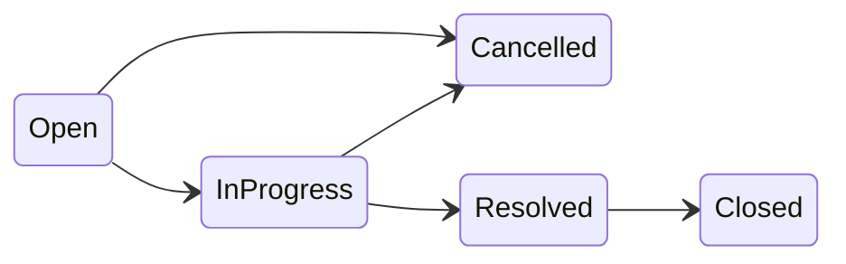

# Core Test Strategy Plan

## Goal

Produce a design-phase **test strategy document** (no test code) that satisfies Prompt 4 in [ai-prompts/design.md](ai-prompts/design.md) and aligns with AC-6 / AC-11 in [acceptance-criteria.md](acceptance-criteria.md).

## Source of truth (locked decisions)

From [requirements-analysis.md](requirements-analysis.md) and [api-contract.md](api-contract.md):

- **5 valid transitions:** Open→InProgress, Open→Cancelled, InProgress→Resolved, InProgress→Cancelled, Resolved→Closed
- **20 invalid transitions:** every other from×to pair, including same-state no-ops and terminal-state moves
- **Invalid response shape:** `400` with `{ "error": "Cannot transition from {current} to {target}", "code": "INVALID_TRANSITION" }`
- **Same-state is NOT idempotent** — Open→Open returns `400` (fix ambiguous note in current [test-strategy.md](test-strategy.md) line 46)
- **Status isolation:** `status` in POST/PUT body → `400` (separate from transition matrix)
- **Test infra:** `WebApplicationFactory` + real/test database (not in-memory mock of business rules)



## File 1: Rewrite [test-strategy.md](test-strategy.md)

Replace the skeleton with a structured document. Proposed sections:

### 1. Purpose and scope

- Core mandatory tier: **state-machine integration tests** via HTTP
- Stretch (optional): unit tests for `StatusTransitionService`, React component tests, E2E
- Link to [design-notes.md](design-notes.md) (`StatusTransitionService` as single enforcement point)

### 2. Test tiers summary

| Tier | Core? | Focus |
|------|-------|-------|
| Integration (API) | **Required** | State machine, validation, 404 |
| Unit | Optional Stretch | Full 25-pair matrix without HTTP |
| Component / E2E | Out of Core | Manual demo sufficient |

### 3. Integration test infrastructure (Section 2 of prompt)

Document recommended setup for `tests/` (no implementation yet):

- **Framework:** xUnit + `Microsoft.AspNetCore.Mvc.Testing`
- **Factory:** Custom `WebApplicationFactory<Program>` overriding `ConfigureWebHost` to:
  - Set `ASPNETCORE_ENVIRONMENT=Testing`
  - Point connection string to test database
  - Run migrations + seed users (3–5) before test suite
- **Database options** (pick one, document trade-offs):
  - **Dedicated PostgreSQL test DB** (preferred — matches production; satisfies AC-11)
  - **Testcontainers PostgreSQL** (CI-friendly, no shared DB pollution)
  - Avoid EF InMemory for state-machine tests (does not prove real persistence)
- **Isolation:** Reset data between tests (transaction rollback, Respawn, or recreate DB per collection)
- **Helpers:** `CreateTicketAsync(status)`, `PatchStatusAsync(id, target)`, `AssertInvalidTransition(from, to)` for parameterized tests
- **Assertions per valid test:** `200`, response `status` matches target, `validNextStatuses` refreshed, `updatedAt` changed, DB re-read confirms persistence
- **Assertions per invalid test:** `400`, body contains `code: "INVALID_TRANSITION"`, exact error message per [api-contract.md](api-contract.md), DB status unchanged

### 4. State machine test matrix (Section 1 of prompt)

**Primary table — all 25 transitions** (5 states × 5 targets):

| From | To | Valid? | Expected HTTP | Error code | Test priority |
|------|-----|--------|---------------|------------|---------------|
| Open | InProgress | Yes | 200 | — | **Mandatory** |
| Open | Cancelled | Yes | 200 | — | **Mandatory** |
| InProgress | Resolved | Yes | 200 | — | **Mandatory** |
| InProgress | Cancelled | Yes | 200 | — | **Mandatory** |
| Resolved | Closed | Yes | 200 | — | **Mandatory** |
| Open | Open | No | 400 | INVALID_TRANSITION | Recommended |
| Open | Resolved | No | 400 | INVALID_TRANSITION | **Mandatory** (≥4 invalid) |
| Open | Closed | No | 400 | INVALID_TRANSITION | **Mandatory** |
| InProgress | Open | No | 400 | INVALID_TRANSITION | Recommended |
| InProgress | InProgress | No | 400 | INVALID_TRANSITION | Recommended |
| InProgress | Closed | No | 400 | INVALID_TRANSITION | **Mandatory** |
| Resolved | Open | No | 400 | INVALID_TRANSITION | Recommended |
| Resolved | InProgress | No | 400 | INVALID_TRANSITION | Recommended |
| Resolved | Resolved | No | 400 | INVALID_TRANSITION | Recommended |
| Resolved | Cancelled | No | 400 | INVALID_TRANSITION | **Mandatory** |
| Closed | * (all 5) | No | 400 | INVALID_TRANSITION | **Mandatory** (terminal) |
| Cancelled | * (all 5) | No | 400 | INVALID_TRANSITION | **Mandatory** (terminal) |

**Implementation guidance (strategy only):**

- **Minimum for Core submission (prompt):** 5 valid + ≥4 invalid integration tests
- **Recommended for maintainability:** parameterized `[Theory]` over full 20 invalid pairs (runtime must reject all per AC-6; tests prove representative + parameterized coverage)
- **Grouped invalid categories** for readability: same-state, skip, backward, post-resolve cancel, terminal

**Secondary table — `validNextStatuses` on GET detail** (smoke, not full matrix):

| Current status | Expected `validNextStatuses` |
|----------------|------------------------------|
| Open | InProgress, Cancelled |
| InProgress | Resolved, Cancelled |
| Resolved | Closed |
| Closed | [] |
| Cancelled | [] |

### 5. Status endpoint isolation tests

| Test | Action | Expected |
|------|--------|----------|
| Status on create | POST with `status` in body | 400 — cannot set on create |
| Status on update | PUT with `status` in body | 400 — must use PATCH |
| Invalid enum on PATCH | PATCH `{ "status": "Urgent" }` | 400 — invalid enum (no INVALID_TRANSITION) |

### 6. Additional recommended integration tests (Section 3 of prompt)

Mirror [acceptance-criteria.md](acceptance-criteria.md) lines 128–136:

**Validation (400):**

- Create ticket: missing/blank title, title >200 chars, description >2000, invalid priority, non-existent `createdBy`
- Create comment: blank message, message >1000, non-existent `createdBy`
- List tickets: invalid `status` query param

**Not found (404):**

- `GET /api/tickets/{id}` — non-existent ID
- `PUT /api/tickets/{id}` — non-existent ID
- `PATCH /api/tickets/{id}/status` — non-existent ID
- `POST /api/tickets/{ticketId}/comments` — non-existent ticket

**Happy-path smoke (200/201):**

- `GET /api/users` returns seeded users
- `POST /api/tickets` creates with default `Open`
- `GET /api/tickets?search=...&status=...` returns filtered results; empty array when no matches (not 404)
- `PUT` on Closed ticket updates fields; status unchanged
- `POST` comment on Closed/Cancelled ticket succeeds

### 7. Edge cases (reference only)

Cross-reference [requirements-analysis.md](requirements-analysis.md) edge-case table (#1–20). Call out:

- Concurrent status updates: last-write-wins — **not tested in Core** (non-deterministic)
- Whitespace trim before validate — cover in validation tests

### 8. Out of scope for Core (Section 4 of prompt)

| Area | Why out of scope |
|------|------------------|
| Authentication / JWT / role-based access | Explicitly excluded in Core; no login to test |
| User CRUD APIs and UI | Users are seeded read-only |
| Ticket delete | Not in spec; Cancelled is abandon path |
| Pagination, sorting | Stretch only |
| Swagger, Docker, CI pipelines | Stretch / ops |
| Playwright / full UI E2E | Manual demo; backend integration tests prove rules |
| Performance / load testing | Not required for assessment |
| Comment edit/delete | Append-only in Core |
| Optimistic concurrency | Last-write-wins by design |
| Unit tests | Optional Stretch (can cover full 25-pair matrix cheaply) |

### 9. How to run and evidence

```bash
cd tests
dotnet test
```

- Document results in [test-results.md](test-results.md) at implementation time
- Expected test project layout: `tests/SupportTicket.Api.Tests/` (name TBD at implementation)

## File 2: Update [ai-prompts/design.md](ai-prompts/design.md)

Fill **Prompt 4 — Test Strategy** Response Log (lines 156–163):

| Field | Value |
|-------|-------|
| **Date** | 2026-07-23 |
| **AI response summary** | Full test-strategy.md: complete 5×5 transition matrix (5 valid, 20 invalid), WebApplicationFactory + PostgreSQL test DB setup, status-endpoint isolation tests, additional validation/404/smoke tests, edge-case cross-ref, Core vs Stretch boundaries; resolved same-state → 400 (not idempotent) |
| **Accepted** | Full transition matrix; mandatory vs recommended test priorities; infrastructure section; alignment with api-contract error shapes |
| **Changed** | Expanded from skeleton; clarified invalid-transition testing uses parameterized approach for full matrix while Core minimum is 5 valid + 4 invalid |
| **Rejected** | — |
| **Why** | Matches locked state machine in requirements-analysis.md and api-contract.md; satisfies AC-11 and Prompt 4 deliverables |

## What will NOT be done in this task

- No test project or C# code
- No changes to [test-results.md](test-results.md) (implementation-phase artifact)
- No edits to [acceptance-criteria.md](acceptance-criteria.md) or [design-notes.md](design-notes.md) (already link to test-strategy)

## Verification

After edits, confirm:

- All 5 valid and all 20 invalid transitions appear in the matrix
- At least 4 invalid cases marked mandatory (prompt minimum)
- Same-state ambiguity removed
- Response log in design.md filled for Prompt 4 only
