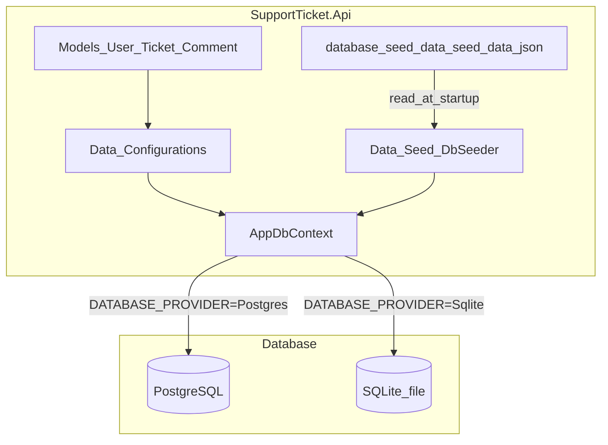

# Database Layer Implementation Plan

## Current state

The repo is **documentation-only** — no `src/`, `.csproj`, or EF Core code exists yet. Only [`database/setup-notes.md`](database/setup-notes.md) is present under `database/`. Implementation must scaffold the API project (task B2.1 from [`implementation-plan.md`](implementation-plan.md)) as a prerequisite for the database layer (B2.2–B2.4).

## Target architecture



## 1. Scaffold solution and API project

Create under [`src/`](src/) per [`design-notes.md`](design-notes.md):

```
src/
  SupportTicket.sln
  SupportTicket.Api/
    SupportTicket.Api.csproj
    Program.cs                    # minimal — DbContext + optional seed only
    Models/
      User.cs, Ticket.cs, Comment.cs
      Enums/TicketPriority.cs, TicketStatus.cs
    Data/
      AppDbContext.cs
      Configurations/
        UserConfiguration.cs
        TicketConfiguration.cs
        CommentConfiguration.cs
      Seed/DbSeeder.cs
```

**NuGet packages** (API project only — no new dependencies beyond EF stack):

| Package | Purpose |
|---------|---------|
| `Microsoft.EntityFrameworkCore` | ORM |
| `Npgsql.EntityFrameworkCore.PostgreSQL` | PostgreSQL provider |
| `Microsoft.EntityFrameworkCore.Sqlite` | SQLite fallback |
| `Microsoft.EntityFrameworkCore.Design` | migrations CLI (PrivateAssets) |
| `Microsoft.EntityFrameworkCore.Tools` | `dotnet ef` (PrivateAssets) |

**Root files:**

- [`.env.example`](.env.example) — connection string, `DATABASE_PROVIDER`, API/frontend URLs (no real secrets)
- Link migration C# files from outside the project folder (see section 4)

## 2. Entity models and enums

Implement per [`data-model.md`](data-model.md):

**Enums** (`Models/Enums/`):

```csharp
public enum TicketPriority { Low, Medium, High }
public enum TicketStatus { Open, InProgress, Resolved, Closed, Cancelled }
```

**Entities** with navigation properties:

| Entity | Key properties | Navigations |
|--------|----------------|-------------|
| `User` | `Id`, `Name`, `Email`, `Role` | `TicketsCreated`, `TicketsAssigned`, `Comments` |
| `Ticket` | `Id`, `Title`, `Description`, `Priority`, `Status`, `AssignedToId?`, `CreatedById`, `CreatedAt`, `UpdatedAt` | `AssignedTo`, `CreatedBy`, `Comments` |
| `Comment` | `Id`, `TicketId`, `Message`, `CreatedById`, `CreatedAt` | `Ticket`, `CreatedBy` |

`Status` defaults to `TicketStatus.Open` on the entity (application default; DB default also set in configuration).

## 3. Fluent API configurations

Create `IEntityTypeConfiguration<T>` classes in [`src/SupportTicket.Api/Data/Configurations/`](src/SupportTicket.Api/Data/Configurations/):

**UserConfiguration**
- Table `Users`; `Name` varchar(100), `Email` varchar(200) unique (`UX_Users_Email`), `Role` varchar(50)
- **No `HasData`** — all seed rows come from JSON at runtime (see section 5)

**TicketConfiguration**
- `Title` varchar(200), `Description` varchar(2000) nullable
- `Priority` / `Status` stored as strings: `.HasConversion<string>()`
- `Status` default `"Open"` at DB level: `.HasDefaultValue(TicketStatus.Open)`
- FKs: `AssignedToId` → Users RESTRICT; `CreatedById` → Users RESTRICT
- Indexes: `IX_Tickets_Status`, `IX_Tickets_Title`, `IX_Tickets_CreatedById`, `IX_Tickets_AssignedToId`

**CommentConfiguration**
- `Message` varchar(1000)
- FK: `TicketId` → Tickets CASCADE; `CreatedById` → Users RESTRICT
- Composite index `IX_Comments_TicketId_CreatedAt` on `(TicketId, CreatedAt)`

**AppDbContext** applies all configurations via `modelBuilder.ApplyConfigurationsFromAssembly(...)`.

## 4. Initial migration in `database/schema-or-migrations/`

EF migrations must compile into the API assembly but live at repo path per prompt:

1. Add to `SupportTicket.Api.csproj`:

```xml
<ItemGroup>
  <Compile Include="..\..\database\schema-or-migrations\*.cs" />
</ItemGroup>
```

2. Generate migration from repo root:

```bash
dotnet ef migrations add InitialCreate \
  --project src/SupportTicket.Api \
  --startup-project src/SupportTicket.Api \
  --output-dir ../../database/schema-or-migrations
```

3. Resulting files in [`database/schema-or-migrations/`](database/schema-or-migrations/):
   - `InitialCreate.cs` (Up/Down)
   - `InitialCreate.Designer.cs`
   - `AppDbContextModelSnapshot.cs`

Migration is **schema-only** — no embedded seed rows.

## 5. Seed data — JSON only

**Single source of truth:** [`database/seed-data/seed-data.json`](database/seed-data/seed-data.json)

No SQL scripts, no `HasData` in migrations, no hardcoded seed rows in C#. `DbSeeder` is the only consumer and **reads/deserializes this JSON file** at startup.

**JSON shape** (stable IDs for FK references):

```json
{
  "users": [
    { "id": 1, "name": "Admin User", "email": "admin@example.com", "role": "Admin" }
  ],
  "tickets": [
    {
      "id": 1,
      "title": "VPN not connecting",
      "description": "Cannot connect to corporate VPN",
      "priority": "High",
      "status": "Open",
      "assignedToId": 2,
      "createdById": 1,
      "createdAt": "2026-01-15T10:00:00Z",
      "updatedAt": "2026-01-15T10:00:00Z"
    }
  ],
  "comments": [
    { "id": 1, "ticketId": 1, "message": "Reproduced on Windows 11", "createdById": 2, "createdAt": "2026-01-15T11:00:00Z" }
  ]
}
```

**Content:** 3–5 users, 2–3 tickets (varied status/priority), 1–2 comments on at least one ticket.

**`DbSeeder.cs`** (`Data/Seed/`):

- Resolve path to `database/seed-data/seed-data.json` relative to repo/content root (e.g. walk up from `AppContext.BaseDirectory` or use `IHostEnvironment.ContentRootPath` + `../../database/seed-data/seed-data.json`)
- Deserialize with `System.Text.Json` into DTO records (no extra NuGet package)
- **Idempotent:** skip seeding if `Users` table already has rows
- Insert users → tickets → comments in FK order; use explicit IDs from JSON so ticket/comment FKs align

**Startup hook** in minimal `Program.cs`:

```csharp
using (var scope = app.Services.CreateScope())
{
    var db = scope.ServiceProvider.GetRequiredService<AppDbContext>();
    var env = scope.ServiceProvider.GetRequiredService<IHostEnvironment>();
    await db.Database.MigrateAsync();
    await DbSeeder.SeedAsync(db, env);
}
```

No controllers registered yet — only `AddDbContext` and the seed/migrate block.

## 6. Env-based PostgreSQL / SQLite switch

Per your preference, use `DATABASE_PROVIDER` in [`.env.example`](.env.example):

```env
DATABASE_PROVIDER=Postgres          # Postgres | Sqlite
ConnectionStrings__DefaultConnection=Host=localhost;Port=5432;Database=ticketdb;Username=postgres;Password=YOUR_PASSWORD
ConnectionStrings__SqliteConnection=Data Source=ticketdb.db
ASPNETCORE_ENVIRONMENT=Development
ASPNETCORE_URLS=http://localhost:5000
VITE_API_URL=http://localhost:5000/api
```

**`Program.cs` registration logic:**

```csharp
var provider = builder.Configuration["DATABASE_PROVIDER"] ?? "Postgres";
builder.Services.AddDbContext<AppDbContext>(options =>
{
    if (provider.Equals("Sqlite", StringComparison.OrdinalIgnoreCase))
        options.UseSqlite(builder.Configuration.GetConnectionString("SqliteConnection"));
    else
        options.UseNpgsql(builder.Configuration.GetConnectionString("DefaultConnection"));
});
```

Load `.env` in Development via `DotNetEnv` is **not** added (avoid extra dependency) — document that users set env vars via shell, `launchSettings.json` placeholders, or a local `.env` loader they choose. `setup-notes.md` will show PowerShell/bash examples for exporting vars.

## 7. Update `database/setup-notes.md`

Replace placeholders (`[YourApiProject]`) with concrete paths and commands:

- Prerequisites (.NET 8, PostgreSQL 14+, `dotnet-ef` tool)
- Create `ticketdb` database (Postgres) or note SQLite file auto-created
- Copy `.env.example` → `.env`
- `dotnet ef database update --project src/SupportTicket.Api`
- Verify with `psql` queries (Postgres) or `sqlite3 ticketdb.db` (SQLite)
- Document `DATABASE_PROVIDER` switch and seed behavior (auto on startup from `database/seed-data/seed-data.json`)
- List files in `database/schema-or-migrations/` and `database/seed-data/seed-data.json`

## 8. Update `ai-prompts/implementation.md` response log

Fill Prompt 1 response log table with:

| Field | Value |
|-------|-------|
| **Date** | 2026-07-23 |
| **AI response summary** | Scaffolded `SupportTicket.Api`, EF entities/configs/DbContext, initial migration, seed data, env-based DB provider, updated setup docs |
| **Accepted** | _(to fill after review)_ |
| **Changed** | Seed data JSON-only (no SQL, no HasData, no hardcoded C# rows) |
| **Rejected** | _(if any)_ |
| **Why** | _(rationale notes)_ |

## Out of scope (this prompt)

- API controllers, services, repositories, DTOs, validators
- `StatusTransitionService` (Prompt 2)
- Test project / `WebApplicationFactory` setup
- React frontend scaffold

## Verification checklist

After implementation, confirm:

1. `dotnet build src/SupportTicket.sln` succeeds
2. `dotnet ef database update --project src/SupportTicket.Api` applies migration (Postgres or SQLite)
3. Tables `Users`, `Tickets`, `Comments` exist with correct indexes/FKs
4. 5 users seeded; 2–3 tickets + comments present after `dotnet run`
5. Data persists across API restart (AC-8 foundation)
6. No secrets in committed files — only `.env.example`
