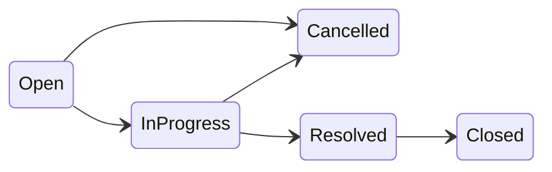

# Status State Machine Service

## Context

- [`TicketStatus`](src/SupportTicket.Api/Models/Enums/TicketStatus.cs) enum already exists with all 5 values (`Open`, `InProgress`, `Resolved`, `Closed`, `Cancelled`).
- No service layer, Result type, or test project exists yet — only the EF Core data layer.
- [`design-notes.md`](design-notes.md) and [`api-contract.md`](api-contract.md) define the rules: **5 valid transitions**, **20 invalid** (including same-state no-ops), error message `"Cannot transition from {current} to {target}"` with `code: "INVALID_TRANSITION"`.
- Controllers and `TicketService` are **out of scope** for this prompt (Prompt 3).

## Architecture constraints (user direction)

**Use Controllers + Services — not Minimal API.**

Per [`design-notes.md`](design-notes.md), the stack is:

```
Controllers → Application Services → StatusTransitionService (pure rules)
```

| Layer | This prompt (Prompt 2) | Prompt 3 |
|-------|------------------------|----------|
| Controllers | Scaffold host only (`AddControllers` / `MapControllers`) — **no endpoint controllers yet** | `TicketsController`, `UsersController` |
| Services | `IStatusTransitionService` / `StatusTransitionService` | `ITicketService`, `IUserService`, etc. |
| Minimal API | **Do not use** `MapGet` / `MapPost` / route handlers in `Program.cs` | — |

`StatusTransitionService` stays pure (no HTTP, no DbContext). Controllers will delegate to `TicketService`, which calls `StatusTransitionService.ValidateTransition` — that wiring is Prompt 3.

## State machine (single source of truth)



| Current | Valid next (API order) |
|---------|------------------------|
| Open | InProgress, Cancelled |
| InProgress | Resolved, Cancelled |
| Resolved | Closed |
| Closed | *(none)* |
| Cancelled | *(none)* |

## Files to create

| File | Purpose |
|------|---------|
| [`src/SupportTicket.Api/Services/Common/ServiceResult.cs`](src/SupportTicket.Api/Services/Common/ServiceResult.cs) | Lightweight Result type (reusable in Prompt 3) |
| [`src/SupportTicket.Api/Services/IStatusTransitionService.cs`](src/SupportTicket.Api/Services/IStatusTransitionService.cs) | Interface |
| [`src/SupportTicket.Api/Services/StatusTransitionService.cs`](src/SupportTicket.Api/Services/StatusTransitionService.cs) | Pure transition logic |
| [`tests/SupportTicket.Api.Tests/SupportTicket.Api.Tests.csproj`](tests/SupportTicket.Api.Tests/SupportTicket.Api.Tests.csproj) | xUnit test project |
| [`tests/SupportTicket.Api.Tests/Services/StatusTransitionServiceTests.cs`](tests/SupportTicket.Api.Tests/Services/StatusTransitionServiceTests.cs) | Parameterized matrix tests |

**No enum changes** — reuse existing `TicketStatus`.

## Service API

```csharp
public interface IStatusTransitionService
{
    bool IsValidTransition(TicketStatus currentStatus, TicketStatus newStatus);
    IEnumerable<string> GetValidNextStatuses(TicketStatus currentStatus);
    ServiceResult ValidateTransition(TicketStatus currentStatus, TicketStatus newStatus);
}
```

### `ServiceResult` (minimal, no new NuGet packages)

```csharp
public sealed class ServiceResult
{
    public bool IsSuccess { get; init; }
    public string? Error { get; init; }
    public string? Code { get; init; }

    public static ServiceResult Ok() => new() { IsSuccess = true };
    public static ServiceResult Fail(string error, string? code = null)
        => new() { IsSuccess = false, Error = error, Code = code };
}
```

`ValidateTransition` returns:
- `ServiceResult.Ok()` when `IsValidTransition` is true
- `ServiceResult.Fail("Cannot transition from Open to Closed", "INVALID_TRANSITION")` when false — message format matches [`api-contract.md`](api-contract.md) exactly (enum `.ToString()` names)

`IsValidTransition` and `GetValidNextStatuses` remain pure query methods; `ValidateTransition` is the Result-based enforcement entry point for `TicketService.ChangeStatusAsync` in Prompt 3.

### Implementation approach

`StatusTransitionService` holds a **static readonly** `Dictionary<TicketStatus, TicketStatus[]>` — the only place transition rules are defined:

```csharp
private static readonly IReadOnlyDictionary<TicketStatus, TicketStatus[]> Transitions = new Dictionary<TicketStatus, TicketStatus[]>
{
    [TicketStatus.Open] = [TicketStatus.InProgress, TicketStatus.Cancelled],
    [TicketStatus.InProgress] = [TicketStatus.Resolved, TicketStatus.Cancelled],
    [TicketStatus.Resolved] = [TicketStatus.Closed],
    [TicketStatus.Closed] = [],
    [TicketStatus.Cancelled] = [],
};
```

- `IsValidTransition` → `Transitions.TryGetValue(current, out var targets) && targets.Contains(newStatus)`
- `GetValidNextStatuses` → `Transitions[current].Select(s => s.ToString())` (stable order per API contract)
- Stateless class; register as **scoped** (standard ASP.NET Core service lifetime with controllers)

### DI and host setup

Update [`Program.cs`](src/SupportTicket.Api/Program.cs) to use the **controller-based host** (replace bare `app.Run()` minimal style):

```csharp
builder.Services.AddControllers();
builder.Services.AddScoped<IStatusTransitionService, StatusTransitionService>();

// ... existing DbContext + seed ...

app.MapControllers();
app.Run();
```

- **No** `MapGet` / `MapPost` minimal API routes
- **No** controller classes yet (`Controllers/` folder created empty or omitted until Prompt 3)
- **No** middleware in this prompt

## Unit tests

New xUnit project referencing `SupportTicket.Api` (project reference only — no `WebApplicationFactory` yet).

Parameterized `[Theory]` tests covering all **25 ordered pairs** (5×5):

| Category | Count | Expected |
|----------|-------|----------|
| Valid transitions | 5 | `IsValidTransition` true; `ValidateTransition.IsSuccess` true |
| Invalid (incl. same-state, terminal) | 20 | `IsValidTransition` false; `ValidateTransition` fails with `INVALID_TRANSITION` and correct message |

Additional tests for `GetValidNextStatuses`:
- Open → `["InProgress", "Cancelled"]`
- Resolved → `["Closed"]`
- Closed / Cancelled → `[]`

Run: `dotnet test tests/SupportTicket.Api.Tests`

## Response log update

Fill Prompt 2 table in [`ai-prompts/implementation.md`](ai-prompts/implementation.md) (lines 79–88):

| Field | Value |
|-------|-------|
| Date | 2026-07-23 |
| AI response summary | Created `IStatusTransitionService` / `StatusTransitionService`, `ServiceResult`, xUnit matrix tests; controller-ready `Program.cs` (`AddControllers`/`MapControllers`); no endpoint controllers |
| Accepted | Pending review |
| Changed | Used `ServiceResult` instead of exceptions; `GetValidNextStatuses` returns `IEnumerable<string>`; scoped service registration; controllers+services pattern (not minimal API) |
| Rejected | Minimal API / endpoint routes in `Program.cs` |
| Why | Result pattern for invalid transitions; controller+service architecture per design-notes; `TicketService` maps `ServiceResult` → 400 JSON in Prompt 3 |

## Out of scope (Prompt 3)

- `TicketsController`, `UsersController`, DTOs, `TicketService`, `ExceptionHandlingMiddleware`
- Integration tests via `PATCH /api/tickets/{id}/status`
- Mapping `ServiceResult` to HTTP 400 responses

## Verification

1. `dotnet build src/SupportTicket.Api`
2. `dotnet test tests/SupportTicket.Api.Tests` — all 25+ cases pass
3. Manual review: transition table matches [`api-contract.md` § Status state machine](api-contract.md)
