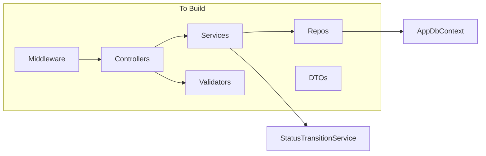

# Backend API — Prompt 3 Implementation Plan

## Current State

**Already done (Prompts 1–2):**
- Entities, `AppDbContext`, PostgreSQL migration, JSON seeding ([`src/SupportTicket.Api/Data/`](src/SupportTicket.Api/Data/))
- [`StatusTransitionService`](src/SupportTicket.Api/Services/StatusTransitionService.cs) with `ServiceResult` and 25-pair unit tests
- [`Program.cs`](src/SupportTicket.Api/Program.cs): `AddControllers`, EF Core, migrate/seed on startup

**Missing:** Controllers, DTOs, validators, repositories, domain services, error middleware, CORS, Swagger/OpenAPI.



---

## 1. Shared Infrastructure

### Extend `ServiceResult`

Add generic [`ServiceResult<T>`](src/SupportTicket.Api/Services/Common/ServiceResult.cs) alongside existing type:

```csharp
public sealed class ServiceResult<T>
{
    public bool IsSuccess { get; init; }
    public T? Value { get; init; }
    public string? Error { get; init; }
    public string? Code { get; init; }
    public bool IsNotFound { get; init; }  // maps to 404
}
```

Services return `ServiceResult<T>.NotFound("Ticket not found")` for missing tickets; controllers map `IsNotFound` → 404, `!IsSuccess` → 400.

### Error response model

Create [`DTOs/Responses/ErrorResponse.cs`](src/SupportTicket.Api/DTOs/Responses/ErrorResponse.cs):

```csharp
public record ErrorResponse(string Error, string? Code = null);
```

Controllers return `BadRequestObjectResult(new ErrorResponse(...))` and `NotFoundObjectResult(new ErrorResponse(...))`.

### Exception handling middleware

Create [`Middleware/ExceptionHandlingMiddleware.cs`](src/SupportTicket.Api/Middleware/ExceptionHandlingMiddleware.cs) per [design-notes.md](design-notes.md):
- Catch unhandled exceptions → 500 `{ "error": "An unexpected error occurred" }`
- Log exception server-side only

### FluentValidation

Add NuGet packages to [`SupportTicket.Api.csproj`](src/SupportTicket.Api/SupportTicket.Api.csproj):
- `FluentValidation`
- `FluentValidation.AspNetCore` (or `FluentValidation.DependencyInjectionExtensions` + manual filter)

Register in `Program.cs`: `AddFluentValidationAutoValidation()` + `AddValidatorsFromAssemblyContaining<CreateTicketRequestValidator>()`.

### Reject `status` on POST/PUT

DTOs omit `status` by design. To satisfy contract (explicit 400 when `status` is sent), add to `CreateTicketRequest` and `UpdateTicketRequest`:

```csharp
[JsonExtensionData]
public Dictionary<string, JsonElement>? ExtensionData { get; set; }
```

Validator rule: if `ExtensionData` contains key `"status"` (case-insensitive) → fail with contract message.

### CORS

In [`Program.cs`](src/SupportTicket.Api/Program.cs):

```csharp
builder.Services.AddCors(o => o.AddDefaultPolicy(p =>
    p.WithOrigins("http://localhost:5173").AllowAnyHeader().AllowAnyMethod()));
// ...
app.UseCors();
```

Place `UseCors()` before `MapControllers()`.

### Swagger / OpenAPI 3

Add `Swashbuckle.AspNetCore` to [`SupportTicket.Api.csproj`](src/SupportTicket.Api/SupportTicket.Api.csproj). Swashbuckle generates **OpenAPI 3.0** documents by default.

Register in `Program.cs`:

```csharp
builder.Services.AddEndpointsApiExplorer();
builder.Services.AddSwaggerGen(options =>
{
    options.SwaggerDoc("v1", new OpenApiInfo
    {
        Title = "Support Ticket Management API",
        Version = "v1",
        Description = "REST API for Core scope — see api-contract.md"
    });
});
```

Enable Swagger UI in Development only (after `app.Build()`, before `MapControllers()`):

```csharp
if (app.Environment.IsDevelopment())
{
    app.UseSwagger();
    app.UseSwaggerUI(options =>
    {
        options.SwaggerEndpoint("/swagger/v1/swagger.json", "Support Ticket API v1");
        options.RoutePrefix = "swagger";  // UI at /swagger
    });
}
```

Update [`Properties/launchSettings.json`](src/SupportTicket.Api/Properties/launchSettings.json) `launchUrl` from `weatherforecast` → `swagger`.

**OpenAPI document enhancements** (optional but low-effort):
- Add `[ProducesResponseType]` attributes on controller actions for 200/201/400/404 response schemas (`ErrorResponse`, DTO types)
- Document query params on `GET /api/tickets` via `[FromQuery]` + XML comments or `SwaggerOperation` attributes
- Enum schemas for `TicketPriority` and `TicketStatus` are inferred automatically from DTO string fields

**Access URLs** (with port 5000):
- Swagger UI: `http://localhost:5000/swagger`
- OpenAPI JSON: `http://localhost:5000/swagger/v1/swagger.json`

### Port alignment

Update [`Properties/launchSettings.json`](src/SupportTicket.Api/Properties/launchSettings.json) from port `5008` → `5000` to match [`.env.example`](.env.example) and [api-contract.md](api-contract.md).

---

## 2. DTOs

All under `src/SupportTicket.Api/DTOs/` with camelCase JSON (ASP.NET Core default).

### Request DTOs (`DTOs/Requests/`)

| DTO | Fields |
|-----|--------|
| `CreateTicketRequest` | `title`, `description?`, `priority`, `assignedTo?`, `createdBy` + `ExtensionData` |
| `UpdateTicketRequest` | `title`, `description?`, `priority`, `assignedTo?` + `ExtensionData` |
| `ChangeStatusRequest` | `status` (string) |
| `CreateCommentRequest` | `message`, `createdBy` |

### Response DTOs (`DTOs/Responses/`)

| DTO | Fields |
|-----|--------|
| `UserResponse` | `id`, `name`, `email`, `role` |
| `TicketListItemResponse` | ticket fields + `assignedToName`, `createdByName` |
| `CommentResponse` | `id`, `message`, `createdBy`, `createdByName`, `createdAt` |
| `TicketDetailResponse` | extends list item shape + `validNextStatuses[]`, `comments[]` |

---

## 3. Validators (`Validators/`)

One FluentValidation class per request DTO. Key rules from [api-contract.md](api-contract.md):

| Validator | Rules |
|-----------|-------|
| `CreateTicketRequestValidator` | Title trim/non-empty/max 200; description max 2000; priority enum; `createdBy` required; `assignedTo` optional; async `UserExists` for FKs; reject `status` in ExtensionData |
| `UpdateTicketRequestValidator` | Same field rules (no `createdBy`); reject `status` in ExtensionData |
| `ChangeStatusRequestValidator` | `status` required; must parse to `TicketStatus` enum |
| `CreateCommentRequestValidator` | Message trim/non-empty/max 1000; `createdBy` required; async user exists |

**Enum parsing helpers** (private static methods or small `EnumParsing` utility):
- Priority: `"Invalid priority value: {value}"`
- Status: `"Invalid status value: {value}"`

**User FK check:** inject `IUserRepository` into validators via constructor DI; rule: `"User with id {id} does not exist"`.

FluentValidation auto-validation returns 400 with `{ "error": "..." }` — configure `CustomizeValidationProblemDetails` or use a filter to match the contract's flat `{ "error" }` shape (not ASP.NET's default `errors` dictionary). A small [`Filters/ValidationExceptionFilter.cs`](src/SupportTicket.Api/Filters/ValidationExceptionFilter.cs) or custom `IExceptionHandler` can reshape validation failures to `{ "error": "<first message>" }`.

---

## 4. Repositories (`Repositories/`)

Thin EF Core wrappers — no HTTP/DTO logic.

| Interface | Key methods |
|-----------|-------------|
| `IUserRepository` | `GetAllAsync()`, `ExistsAsync(int id)` |
| `ITicketRepository` | `ListAsync(search?, status?)`, `GetByIdWithDetailsAsync(id)`, `AddAsync`, `UpdateAsync` |
| `ICommentRepository` | `AddAsync(comment)` |

**List query** ([design-notes.md](design-notes.md)):
- `status`: exact match when provided
- `search`: `EF.Functions.ILike` on `Title` and `Description` (case-insensitive)
- Eager-load `AssignedTo`, `CreatedBy` for name denormalization

**Detail query:**
- `Include` comments ordered by `CreatedAt ASC`
- `Include` `AssignedTo`, `CreatedBy`

Register all repositories as scoped in `Program.cs`.

---

## 5. Services (`Services/`)

Manual DTO mapping in services (no AutoMapper).

### `UserService`

- `GetAllAsync()` → `IEnumerable<UserResponse>`

### `TicketService`

Depends on `ITicketRepository`, `IUserRepository`, `IStatusTransitionService`.

| Method | Behavior |
|--------|----------|
| `ListAsync(search?, statusFilter?)` | Parse `statusFilter` string → enum or return 400 `"Invalid status value: {value}"`; map to `TicketListItemResponse[]` |
| `GetByIdAsync(id)` | 404 if missing; populate `validNextStatuses` via `_statusTransition.GetValidNextStatuses(ticket.Status)` |
| `CreateAsync(dto)` | Set `Status = Open`, `CreatedAt/UpdatedAt = UtcNow`; return `TicketDetailResponse` (201) |
| `UpdateAsync(id, dto)` | 404 if missing; full replace of updatable fields; `assignedTo = null` clears assignee; bump `UpdatedAt` |
| `ChangeStatusAsync(id, dto)` | 404 if missing; parse enum; call `_statusTransition.ValidateTransition()`; on fail return 400 + `INVALID_TRANSITION`; on success persist and return detail |

### `CommentService`

- `CreateAsync(ticketId, dto)` → 404 if ticket missing; set `CreatedAt = UtcNow`; return `CommentResponse` (201)

---

## 6. Controllers (`Controllers/`)

Thin controllers — delegate to services, map `ServiceResult<T>` to HTTP status codes.

### `UsersController` — route `api/users`

| Action | Route | Returns |
|--------|-------|---------|
| `GetAll` | `GET /api/users` | 200 `UserResponse[]` |

### `TicketsController` — route `api/tickets`

| Action | Route | Returns |
|--------|-------|---------|
| `GetAll` | `GET /api/tickets` | 200 list; 400 invalid status filter |
| `GetById` | `GET /api/tickets/{id}` | 200 detail; 404 |
| `Create` | `POST /api/tickets` | 201 detail; 400 validation |
| `Update` | `PUT /api/tickets/{id}` | 200 detail; 400/404 |
| `ChangeStatus` | `PATCH /api/tickets/{id}/status` | 200 detail; 400 (incl. `INVALID_TRANSITION`); 404 |
| `AddComment` | `POST /api/tickets/{ticketId}/comments` | 201 `CommentResponse`; 400/404 |

Helper method on a base class or static `ApiResult.From(ServiceResult<T>)` to avoid repetitive status-code mapping.

---

## 7. Program.cs — Final DI Registration

```csharp
builder.Services.AddControllers();
builder.Services.AddEndpointsApiExplorer();
builder.Services.AddSwaggerGen(...);  // OpenAPI 3 — see section 1
builder.Services.AddCors(...);
builder.Services.AddFluentValidationAutoValidation();
builder.Services.AddValidatorsFromAssemblyContaining<CreateTicketRequestValidator>();

builder.Services.AddDbContext<AppDbContext>(...);
builder.Services.AddScoped<IStatusTransitionService, StatusTransitionService>();
builder.Services.AddScoped<IUserRepository, UserRepository>();
builder.Services.AddScoped<ITicketRepository, TicketRepository>();
builder.Services.AddScoped<ICommentRepository, CommentRepository>();
builder.Services.AddScoped<IUserService, UserService>();
builder.Services.AddScoped<ITicketService, TicketService>();
builder.Services.AddScoped<ICommentService, CommentService>();

var app = builder.Build();
app.UseMiddleware<ExceptionHandlingMiddleware>();
if (app.Environment.IsDevelopment()) { app.UseSwagger(); app.UseSwaggerUI(...); }
app.UseCors();
app.MapControllers();
```

Keep existing migrate/seed block.

---

## 8. Response Log Update

After implementation, fill Prompt 3 table in [`ai-prompts/implementation.md`](ai-prompts/implementation.md) (lines 124–133):

| Field | Planned content |
|-------|-----------------|
| **Date** | 2026-07-23 |
| **AI response summary** | 7 endpoints, DTOs, FluentValidation, 3 repositories, 3 services, 2 controllers, error middleware, CORS, Swagger UI + OpenAPI 3 |
| **Accepted** | Pending review |
| **Changed** | Swagger/OpenAPI added per user request (was Stretch in original contract); note any other deviations |
| **Rejected** | — |
| **Why** | Follow design-notes controller+service pattern; reuse existing StatusTransitionService |

---

## 9. Verification

Run after implementation:

```bash
dotnet build src/SupportTicket.slnx
dotnet test tests/SupportTicket.Api.Tests
```

Manual smoke test (API running with Postgres):
- Open `http://localhost:5000/swagger` — all 7 endpoints visible with request/response schemas
- Download/inspect `http://localhost:5000/swagger/v1/swagger.json` — valid OpenAPI 3.0 document
- `GET /api/users` — returns seeded users
- `GET /api/tickets?status=Open` — filtered list
- `POST /api/tickets` — creates with `status: "Open"`
- `PATCH /api/tickets/1/status` with `{ "status": "Closed" }` from Open — 400 `INVALID_TRANSITION`
- `PUT /api/tickets/1` with `{ "status": "Closed" }` in body — 400 status-rejected message

**Out of scope for this prompt** (deferred to testing phase per [implementation-plan.md](implementation-plan.md) T4.1):
- `WebApplicationFactory` integration tests (AC-11)
- React frontend

---

## File Count Estimate

~25 new files across `Controllers/`, `DTOs/`, `Validators/`, `Repositories/`, `Services/`, `Middleware/`, `Filters/` plus edits to `Program.cs`, `ServiceResult.cs`, `SupportTicket.Api.csproj` (FluentValidation + Swashbuckle), `launchSettings.json`, and `implementation.md`.
