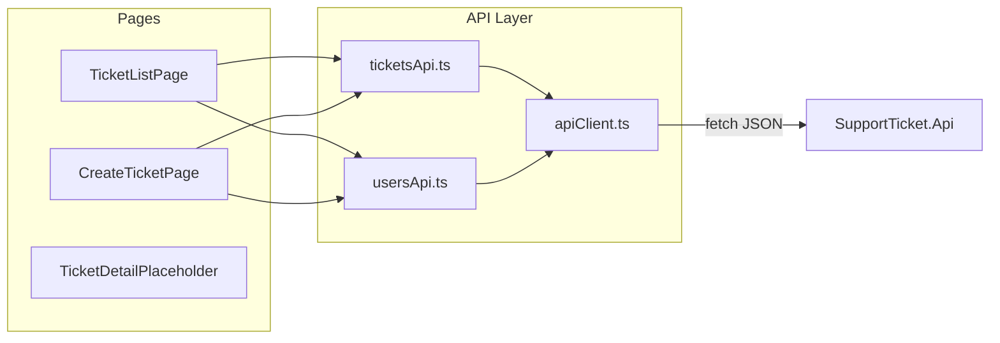

# React Frontend — Ticket List & Create

## Context

- **Backend ready:** 7 REST endpoints live in [`src/SupportTicket.Api`](src/SupportTicket.Api); CORS allows `http://localhost:5173` ([`Program.cs`](src/SupportTicket.Api/Program.cs) lines 44–50).
- **No frontend exists yet:** zero `.tsx` files in the repo.
- **API base URL:** `VITE_API_URL=http://localhost:5000/api` (already in [`.env.example`](.env.example)).
- **Styling:** Material UI (MUI) per your preference.

## Architecture



## 1. Scaffold Vite + React + TypeScript + MUI

Create [`src/SupportTicket.Web`](src/SupportTicket.Web) via `npm create vite@latest` (react-ts template).

**Dependencies:**
- `react-router-dom` — routing between list, create, and detail stub
- `@mui/material` + `@emotion/react` + `@emotion/styled` — UI components
- `@mui/icons-material` (optional) — back/navigation icons

**Config files:**
- [`src/SupportTicket.Web/vite.config.ts`](src/SupportTicket.Web/vite.config.ts) — default Vite config
- [`src/SupportTicket.Web/.env.example`](src/SupportTicket.Web/.env.example) — `VITE_API_URL=http://localhost:5000/api`
- [`src/SupportTicket.Web/tsconfig.json`](src/SupportTicket.Web/tsconfig.json) — strict TypeScript

**Entry wiring** in [`src/SupportTicket.Web/src/main.tsx`](src/SupportTicket.Web/src/main.tsx):
- `BrowserRouter`
- MUI `ThemeProvider` + `CssBaseline`

## 2. Shared types and API client

**Types** — [`src/SupportTicket.Web/src/types/api.ts`](src/SupportTicket.Web/src/types/api.ts) matching [`api-contract.md`](api-contract.md):

| Type | Fields |
|------|--------|
| `User` | `id`, `name`, `email`, `role` |
| `TicketListItem` | all list fields incl. `assignedToName`, `createdAt`, `updatedAt` |
| `CreateTicketRequest` | `title`, `description?`, `priority`, `assignedTo?`, `createdBy` |
| `ApiError` | `{ error: string; code?: string }` |
| `TicketPriority` | `'Low' \| 'Medium' \| 'High'` |
| `TicketStatus` | `'Open' \| 'InProgress' \| 'Resolved' \| 'Closed' \| 'Cancelled'` |

**API client** — [`src/SupportTicket.Web/src/api/client.ts`](src/SupportTicket.Web/src/api/client.ts):
- Read `import.meta.env.VITE_API_URL` (throw clear error if missing)
- `request<T>(path, options)` wrapper using `fetch`
- Parse JSON; on non-OK status throw `ApiError` from `{ error, code? }`
- On network failure throw a distinguishable error for "Unable to connect" banner

**Endpoint modules:**
- [`usersApi.ts`](src/SupportTicket.Web/src/api/usersApi.ts) — `getUsers()` → `GET /users`
- [`ticketsApi.ts`](src/SupportTicket.Web/src/api/ticketsApi.ts) — `getTickets(search?, status?)` → `GET /tickets?...`; `createTicket(body)` → `POST /tickets`

## 3. Utilities and hooks

- [`src/SupportTicket.Web/src/hooks/useDebounce.ts`](src/SupportTicket.Web/src/hooks/useDebounce.ts) — 300ms debounce for search input (per [`ui-flow.md`](ui-flow.md) Flow 1)
- [`src/SupportTicket.Web/src/utils/formatDate.ts`](src/SupportTicket.Web/src/utils/formatDate.ts) — format ISO UTC timestamps for table display
- [`src/SupportTicket.Web/src/utils/createdByStorage.ts`](src/SupportTicket.Web/src/utils/createdByStorage.ts) — persist last-selected `createdBy` in `localStorage` (per [`design-notes.md`](design-notes.md) Frontend Design)

## 4. Routing

[`src/SupportTicket.Web/src/App.tsx`](src/SupportTicket.Web/src/App.tsx):

| Route | Component | Purpose |
|-------|-----------|---------|
| `/` | redirect → `/tickets` | Default landing |
| `/tickets` | `TicketListPage` | List + filters |
| `/tickets/new` | `CreateTicketPage` | Create form |
| `/tickets/:id` | `TicketDetailPlaceholder` | Row-click target only (Prompt 5 scope) |

**Detail placeholder** — minimal MUI page: "Ticket detail coming soon" + link back to list. Satisfies row-click navigation without implementing Prompt 5.

## 5. Ticket List page (AC-2, AC-7)

[`src/SupportTicket.Web/src/pages/TicketListPage.tsx`](src/SupportTicket.Web/src/pages/TicketListPage.tsx)

**Layout (MUI):**
- `Container` + page title "Support Tickets"
- Toolbar row:
  - `TextField` search input (controlled, debounced via `useDebounce`)
  - `Select` status filter with options: All, Open, InProgress, Resolved, Closed, Cancelled
  - `Button` variant="contained" "Create Ticket" → `/tickets/new`
- `Table` / `TableContainer` with columns: Title, Priority, Status, Assignee, Created, Updated
- `TableRow` `hover` + `onClick` → `navigate(/tickets/${id})`

**States:**
| State | UI |
|-------|-----|
| Loading | `CircularProgress` centered |
| Network error | MUI `Alert` severity="error": "Unable to connect to the API" |
| 400 (invalid status filter) | `Alert` with server `error` message |
| Empty `[]` | Typography: "No tickets match your search" (not an error) |
| Data | Populated table; unassigned shows "Unassigned" |

**Data flow:** `useEffect` re-fetches when `debouncedSearch` or `statusFilter` changes; builds query string `?search=...&status=...` omitting empty params.

## 6. Create Ticket page (AC-1)

[`src/SupportTicket.Web/src/pages/CreateTicketPage.tsx`](src/SupportTicket.Web/src/pages/CreateTicketPage.tsx)

**Form fields (MUI `TextField` / `Select`):**
- Title — required text input
- Description — optional multiline
- Priority — required select: Low / Medium / High (default Medium)
- Assignee — select from `GET /users` + "Unassigned" option (`assignedTo: null`)
- Created By — required select from users; default first user or `localStorage` value

**Submit:**
- `POST /api/tickets` via `createTicket()`
- On **201** → save `createdBy` to `localStorage`, redirect to `/tickets` (detail not built yet)
- On **400** → show MUI `Alert` with API `error` string (flat envelope — no per-field errors from backend)
- Disable submit + show `CircularProgress` while submitting

**Loading users:** fetch on mount; show loading spinner until dropdowns are ready.

## 7. Reusable components (thin wrappers)

Keep page files readable with small components under [`src/SupportTicket.Web/src/components/`](src/SupportTicket.Web/src/components/):
- `ErrorBanner.tsx` — MUI Alert for API/network errors
- `LoadingState.tsx` — centered spinner
- `TicketStatusChip.tsx` — color-coded status badge (optional polish)

## 8. Documentation updates

After implementation:

1. **[`ai-prompts/implementation.md`](ai-prompts/implementation.md)** — fill Prompt 4 Response Log (date, summary, accepted/changed/rejected/why)
2. **[`README.md`](README.md)** — replace `src/[FrontendProject]` placeholders with `src/SupportTicket.Web` and add `npm install` / `npm run dev` steps (minimal edit, lines 42–50)
3. **[`tool-specific/cursor-workflow/tasks.md`](tool-specific/cursor-workflow/tasks.md)** — check off "Prompt 4 — React frontend — list & create"

## 9. Manual verification

With API running on port 5000 and frontend on 5173:

1. List loads seeded tickets from DB (not hardcoded)
2. Debounced search filters via `?search=`
3. Status dropdown filters via `?status=`
4. Combined filters work; empty results show friendly message
5. Row click navigates to `/tickets/:id` placeholder
6. Create form submits valid ticket → appears in list with status Open
7. Submit with blank title → API 400 error displayed
8. Stop API → list shows connection error banner

## Out of scope (Prompt 5)

- Ticket detail view, PUT edit, PATCH status, comments, 404 detail page

## Key files to create

```
src/SupportTicket.Web/
  package.json
  vite.config.ts
  tsconfig.json
  index.html
  .env.example
  src/
    main.tsx
    App.tsx
    types/api.ts
    api/client.ts, ticketsApi.ts, usersApi.ts
    hooks/useDebounce.ts
    utils/formatDate.ts, createdByStorage.ts
    pages/TicketListPage.tsx, CreateTicketPage.tsx, TicketDetailPlaceholder.tsx
    components/ErrorBanner.tsx, LoadingState.tsx
```
