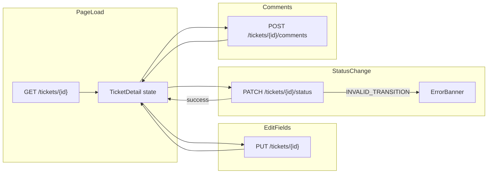

# Ticket Detail Page Implementation

## Context

Prompt 4 scaffolded [`src/SupportTicket.Web`](src/SupportTicket.Web) with list/create flows. The route `/tickets/:id` still renders [`TicketDetailPlaceholder.tsx`](src/SupportTicket.Web/src/pages/TicketDetailPlaceholder.tsx). The backend already exposes all required endpoints per [`api-contract.md`](api-contract.md); the gap is types, API client functions, and the detail UI.



## 1. Extend types and API client

### Types — [`src/SupportTicket.Web/src/types/api.ts`](src/SupportTicket.Web/src/types/api.ts)

Add:

```ts
Comment { id, message, createdBy, createdByName, createdAt }
TicketDetail extends TicketListItem { validNextStatuses: TicketStatus[], comments: Comment[] }
UpdateTicketRequest { title, description?, priority, assignedTo? }
ChangeStatusRequest { status: TicketStatus }
CreateCommentRequest { message, createdBy }
```

### API functions — [`src/SupportTicket.Web/src/api/ticketsApi.ts`](src/SupportTicket.Web/src/api/ticketsApi.ts)

| Function | Method | Path |
|----------|--------|------|
| `getTicket(id)` | GET | `/tickets/{id}` |
| `updateTicket(id, body)` | PUT | `/tickets/{id}` |
| `changeTicketStatus(id, body)` | PATCH | `/tickets/{id}/status` |
| `addComment(ticketId, body)` | POST | `/tickets/{ticketId}/comments` |

`updateTicket` and `changeTicketStatus` return `TicketDetail` (full detail with refreshed `validNextStatuses` and comments). `addComment` returns `Comment`.

### 404 detection — [`src/SupportTicket.Web/src/api/client.ts`](src/SupportTicket.Web/src/api/client.ts)

Add `readonly status: number` to `ApiRequestError` (set from `response.status` in `request()`). This enables clean `err.status === 404` checks instead of matching error message strings.

---

## 2. Build `TicketDetailPage`

**New file:** [`src/SupportTicket.Web/src/pages/TicketDetailPage.tsx`](src/SupportTicket.Web/src/pages/TicketDetailPage.tsx)

**Replace** placeholder in [`App.tsx`](src/SupportTicket.Web/src/App.tsx). Delete [`TicketDetailPlaceholder.tsx`](src/SupportTicket.Web/src/pages/TicketDetailPlaceholder.tsx).

### Page load and error states

- Parse `id` from `useParams()`; if non-numeric, show inline invalid-ID message with back link.
- On mount: `getTicket(id)` with `cancelled` flag (same pattern as [`CreateTicketPage.tsx`](src/SupportTicket.Web/src/pages/CreateTicketPage.tsx)).
- **Loading:** `<LoadingState />`
- **404:** Dedicated not-found card — "Ticket not found" + "Back to tickets" button (per [`ui-flow.md`](ui-flow.md) Flow 3 / error table).
- **Network/other errors:** `<ErrorBanner />` with retry affordance (reload ticket).

### Layout (match existing MUI patterns)

Use `Container maxWidth="lg"`, back button + `PageHeader`, bordered `Paper` sections — consistent with list/create pages.

**Read-only metadata row:**
- Ticket ID, `TicketStatusChip`, `PriorityChip` (from saved ticket, not draft form)
- Created by (`UserAvatar` + name), assignee display name
- `formatDate(createdAt)` / `formatDate(updatedAt)`

**Edit section (PUT):**
- Fields: title, description, priority (`ToggleButtonGroup` + `PriorityChip`), assignee (`Select` with users from `getUsers()`)
- Initialize form state from loaded ticket; track `isDirty`
- "Save changes" button — disabled when not dirty or while saving
- On success: replace `ticket` state from PUT response; clear dirty flag
- On 400: show `ErrorBanner` with `err.message`

**Status section (PATCH) — signature judgment piece:**

Drive dropdown **only** from `ticket.validNextStatuses` returned by the API (no duplicated client-side state machine).

| State | UI behavior |
|-------|-------------|
| `validNextStatuses.length > 0` | `Select` with placeholder "Change status…"; options labeled via existing `formatStatusLabel` |
| Terminal (`Closed` / `Cancelled`) | Disabled select or helper text: "No further status changes" |
| On select | Immediately call `changeTicketStatus(id, { status })` |
| On success | Replace ticket state from PATCH response (updates badge + `validNextStatuses`) |
| On `INVALID_TRANSITION` | Show dedicated `ErrorBanner` (or `Alert severity="warning"`) with **exact** `err.message` (e.g. "Cannot transition from Open to Closed"); **revert** dropdown to empty/previous selection |
| While patching | Disable status select |

Current status shown as read-only `TicketStatusChip` beside the dropdown — dropdown lists only *next* statuses, not current (per [`ui-flow.md`](ui-flow.md) Flow 4).

**Comments section:**
- List `ticket.comments` oldest-first (API order) — each item: author avatar, name, `formatDate(createdAt)`, message body
- Empty state: "No comments yet"
- Add form: `TextField` (multiline) + `createdBy` user dropdown (default from `getStoredCreatedBy()` / `setStoredCreatedBy()` — same as create page)
- On submit: `addComment()` → append returned `Comment` to local state (or refetch ticket for `updatedAt` sync)
- Validation errors via `ErrorBanner`

### Optional small component

Extract [`CommentList`](src/SupportTicket.Web/src/components/CommentList.tsx) only if the detail page grows unwieldy; otherwise keep comments inline to minimize scope.

---

## 3. Routing

In [`App.tsx`](src/SupportTicket.Web/src/App.tsx):

```tsx
<Route path="/tickets/:id" element={<TicketDetailPage />} />
```

**Out of scope (unless you want it):** changing create-success redirect from list → detail ([`ui-flow.md`](ui-flow.md) allows either).

---

## 4. Response log update

After implementation, fill Prompt 5 table in [`ai-prompts/implementation.md`](ai-prompts/implementation.md) (lines 205–212):

| Field | Content to log |
|-------|----------------|
| **Date** | 2026-07-23 |
| **AI response summary** | Types + 4 API functions, `TicketDetailPage` with edit/status/comments/404, `ApiRequestError.status`, replaced placeholder |
| **Accepted / Changed / Rejected / Why** | Note any deviations (e.g. inline vs extracted components, comment refresh strategy) |

---

## Key files

| Action | File |
|--------|------|
| Modify | [`src/SupportTicket.Web/src/types/api.ts`](src/SupportTicket.Web/src/types/api.ts) |
| Modify | [`src/SupportTicket.Web/src/api/client.ts`](src/SupportTicket.Web/src/api/client.ts) |
| Modify | [`src/SupportTicket.Web/src/api/ticketsApi.ts`](src/SupportTicket.Web/src/api/ticketsApi.ts) |
| Create | [`src/SupportTicket.Web/src/pages/TicketDetailPage.tsx`](src/SupportTicket.Web/src/pages/TicketDetailPage.tsx) |
| Modify | [`src/SupportTicket.Web/src/App.tsx`](src/SupportTicket.Web/src/App.tsx) |
| Delete | [`src/SupportTicket.Web/src/pages/TicketDetailPlaceholder.tsx`](src/SupportTicket.Web/src/pages/TicketDetailPlaceholder.tsx) |
| Modify | [`ai-prompts/implementation.md`](ai-prompts/implementation.md) — response log only |

---

## Verification

Manual test checklist (no frontend test harness exists yet):

1. Open seeded ticket from list → all fields render
2. Edit title/assignee → Save → persists on reload
3. Open ticket: status dropdown shows only valid next options (e.g. Open → InProgress, Cancelled)
4. Closed ticket: no status options available
5. Force invalid transition (if testable via devtools) → API message shown clearly
6. Add comment → appears in thread with author and timestamp
7. Navigate to `/tickets/99999` → 404 UI with back link
8. Stop backend → network error banner on load

Run `npm run build` and `npm run lint` in `src/SupportTicket.Web` to confirm type-check and lint pass.
