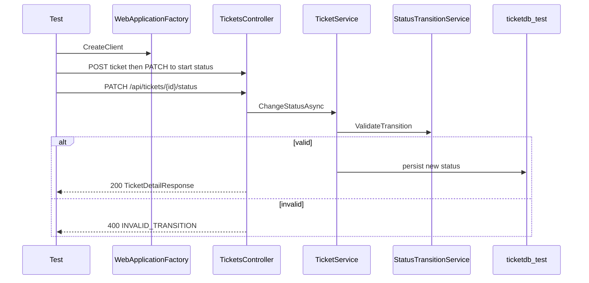

# Status State Machine Integration Tests

## Approach

Follow [test-strategy.md](test-strategy.md): HTTP integration tests via `WebApplicationFactory<Program>` against a **dedicated PostgreSQL test DB** (`ticketdb_test`), not EF InMemory (strategy marks InMemory as unsuitable for proving persistence).

Reuse existing production startup in [Program.cs](src/SupportTicket.Api/Program.cs) (`MigrateAsync` + `DbSeeder`) by overriding only the connection string. `public partial class Program;` is already present for the factory.

Scope is **Prompt 1 only**: the 5 valid + 5 listed invalid transitions. Do not add Prompt 2 validation/404 tests yet.

## Infrastructure

**1. Packages** — update [tests/SupportTicket.Api.Tests/SupportTicket.Api.Tests.csproj](tests/SupportTicket.Api.Tests/SupportTicket.Api.Tests.csproj):

- Add `Microsoft.AspNetCore.Mvc.Testing` (net8-aligned)

**2. Factory** — `tests/SupportTicket.Api.Tests/Infrastructure/CustomWebApplicationFactory.cs`:

- `WebApplicationFactory<Program>` + `IClassFixture`
- `UseEnvironment("Testing")`
- Override `ConnectionStrings:DefaultConnection` to  
  `Host=localhost;Port=5432;Database=ticketdb_test;Username=postgres;Password=password`  
  (same credentials as [appsettings.json](src/SupportTicket.Api/appsettings.json), separate DB name so prod `ticketdb` is untouched)
- On factory init: ensure DB is migrated (startup already calls `MigrateAsync`); optionally `EnsureDeleted` once so suite starts clean
- Rely on existing [DbSeeder](src/SupportTicket.Api/Data/Seed/DbSeeder.cs) for users (needed for `createdBy` on POST)

**3. Helpers** — `tests/SupportTicket.Api.Tests/Helpers/TicketApiHelpers.cs`:

| Helper | Behavior |
|--------|----------|
| `CreateTicketAsync` | `POST /api/tickets` with seeded user id `1`, Medium priority |
| `SeedTicketAtStatusAsync(status)` | Create Open, then walk valid PATCH chain to target (`Open`→`InProgress`→`Resolved`→`Closed`, or `Open`→`Cancelled`) |
| `PatchStatusAsync(id, status)` | `PATCH /api/tickets/{id}/status` with `{ "status": "..." }` |
| `GetTicketAsync(id)` | `GET /api/tickets/{id}` for persistence checks |

## Tests

**File:** `tests/SupportTicket.Api.Tests/Integration/StatusTransitionIntegrationTests.cs`

Use `[Theory]` + `InlineData` for the two groups:

**Valid (expect 200):**
- Open → InProgress
- InProgress → Resolved
- Resolved → Closed
- Open → Cancelled
- InProgress → Cancelled

Assert: status code 200; response `status` equals target; `validNextStatuses` matches matrix from api-contract; optional GET confirms persistence.

**Invalid (expect 400):**
- Open → Closed
- Open → Resolved
- Closed → Open
- Cancelled → InProgress
- Resolved → Open

Assert: status code 400; body `code == "INVALID_TRANSITION"`; `error` matches `Cannot transition from {from} to {to}`; GET confirms status unchanged.

JSON: System.Text.Json camelCase (default for ASP.NET). Deserialize into existing DTOs (`TicketDetailResponse`, `ErrorResponse`) or anonymous/records in the test project.

## Validation

1. Ensure local Postgres is running (same as app).
2. Run `dotnet test` from repo root or `tests/`.
3. Confirm all new integration tests + existing [StatusTransitionServiceTests](tests/SupportTicket.Api.Tests/Services/StatusTransitionServiceTests.cs) pass.

## Out of scope (later prompts)

- Full 20 invalid matrix, status isolation, validation/404 suites
- Updating `test-results.md` (Prompt 2/3)
- Testcontainers / Docker (no compose in repo; dedicated local DB is enough)